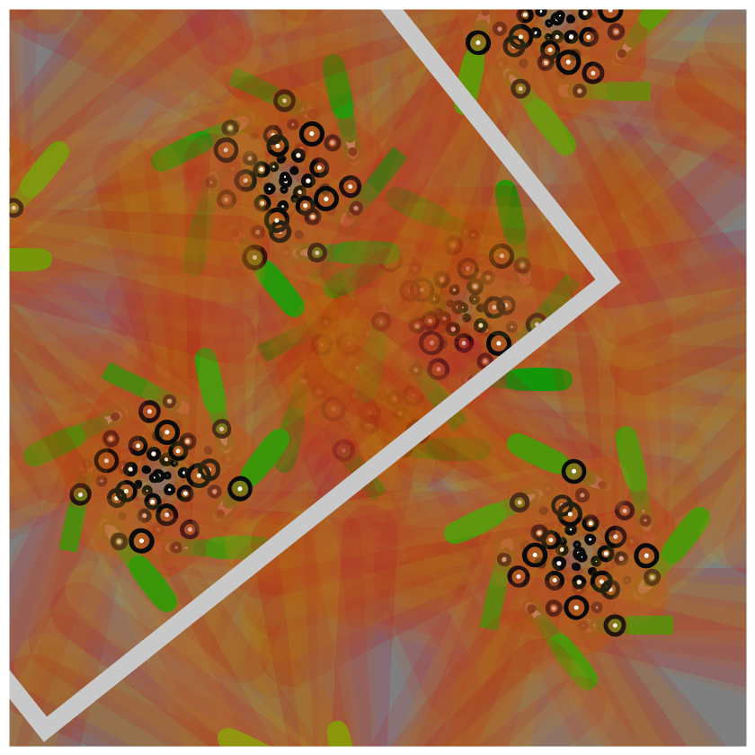

## Jan 01: Triple Nested Loops

## Description
I wanted an 'organic' image that didn't look too geometric. This code is just 3 nested loops, with three index variables one for each loop. These variables dictate the color, stroke width, and size of the shapes (lines, ellipses). There are 3 "layers" with each layer progressively getting sharper and finer in resolution.

## Technical Notes
- I didn't want to use random numbers
- The variables (v1, v2, and v3) are used to alter the x,y coordinates and other attributes
- It was a lot of trial and error
- I brought in a few prime numbers hoping to break simple symmetry
- It was only when I added `translate` and `rotate` that I started to get what I wanted.
- I am deliberately leaving out popMatrix/pushMatrix in each loop, so that the translation and the rotation builds on the previous value.
- The partial white rectangle that dissects the frame was initially an accident, but I liked it so I worked it into the frame.

- The Code can be [found here](Jan01_Triple_Nested_Loops)

## Project Structure

For each day that I attempt to create something, I hope to follow this structure
- Art artifact (jpeg, png or gif)
- A brief description of the end product, and possibly the thinking behind it
- Some technical notes and challenges
- Code
- References, if any

## Code and Common Modules

For most of these, I am using the `Processing` Framework. Since I mostly code in Python, I use [the Python extension of Processing](https://py.processing.org/reference/), which is not as popular as its Java version. Also, I sometimes create small resuable code segments
which I use in multiple projects. I'm sharing all my genart code, in case it is useful to others.

Ram