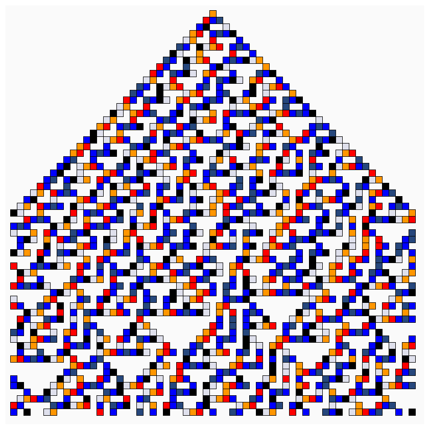
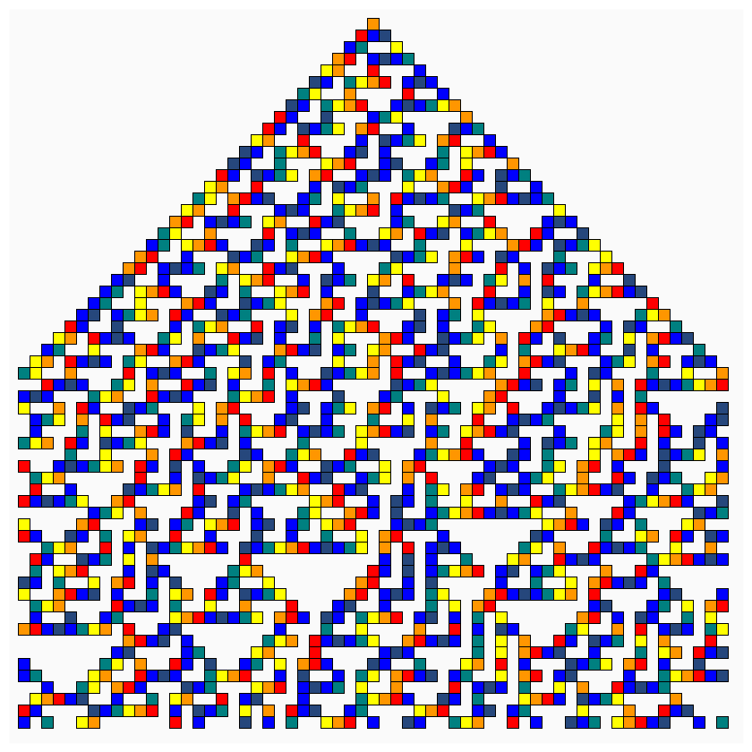
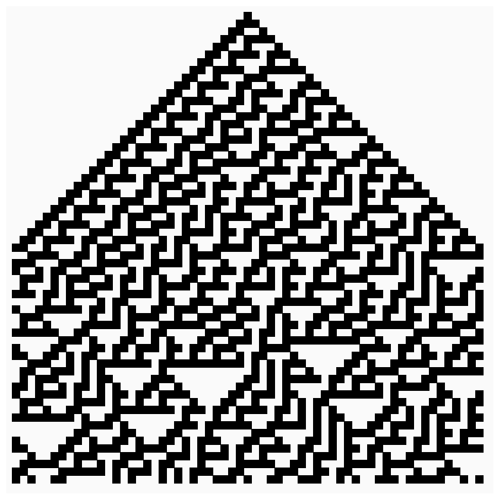

## Jan 02: Rule 30 Cellular Autamata

Other images can be [found here](images)

## Description
Starting with a vanilla version of Rule 30. Experimented with having a rotating palette of colors for 1 (instead of black). Finally, made a Rule-30 Tile, and used that in a 4x4 grid.

## Technical Notes
- No use of random numbers

- The Code can be [found here](.)

## Project Structure

- Art artifact (jpeg, png or gif)
- A brief description of the end product, and possibly the thinking behind it
- Some technical notes and challenges
- Code
- References, if any

## References
- https://en.wikipedia.org/wiki/Rule_30
- https://mathworld.wolfram.com/Rule30.html
- https://mathworld.wolfram.com/ElementaryCellularAutomaton.html

## Code and Common Modules

This sketch uses `grid.py` and `colors.py`

For most of these, I am using the `Processing` Framework. Since I mostly code in Python, I use [the Python extension of Processing](https://py.processing.org/reference/), which is not as popular as its Java version. Also, I sometimes create small resuable code segments
which I use in multiple projects. I'm sharing all my genart code, in case others find it useful.

Ram