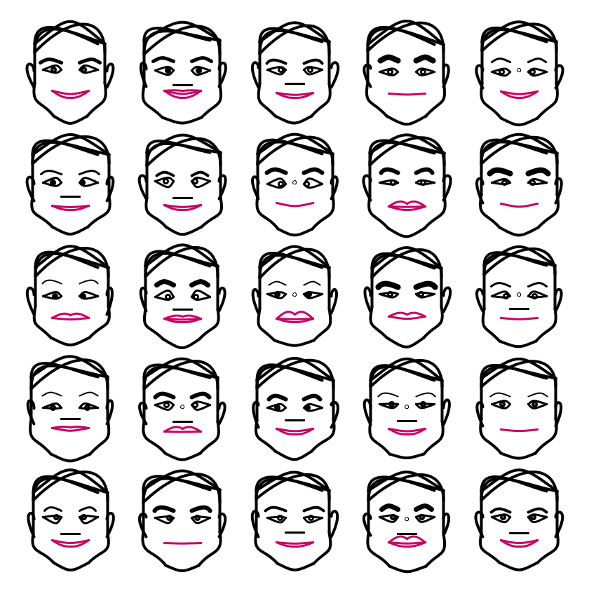

## Jan 03: Something Human

## Description

Using lines and curves, draw a Human. Use proportions and geometry to generate "emotions."

## Technical Notes
Ended up writing a Face class, with many many functions to render and vary parts of the human face. Code is not optimized since it was a one day project!

- The Code can be [found here](.)

## Project Structure

- Art artifact (jpeg, png or gif)
- A brief description of the end product, and possibly the thinking behind it
- Some technical notes and challenges
- Code
- References, if any

## References
- https://thevirtualinstructor.com/facialproportions.html

## Code and Common Modules
This sketch uses `grid.py` and `colors.py`
The code for rendering a Face can be found in `face.py`

`draw_face.py` is what you have to run to recreate these images.

For most of these, I am using the `Processing` Framework. Since I mostly code in Python, I use [the Python extension of Processing](https://py.processing.org/reference/), which is not as popular as its Java version. Also, I sometimes create small resuable code segments
which I use in multiple projects. I'm sharing all my genart code, in case others find it useful.

Ram