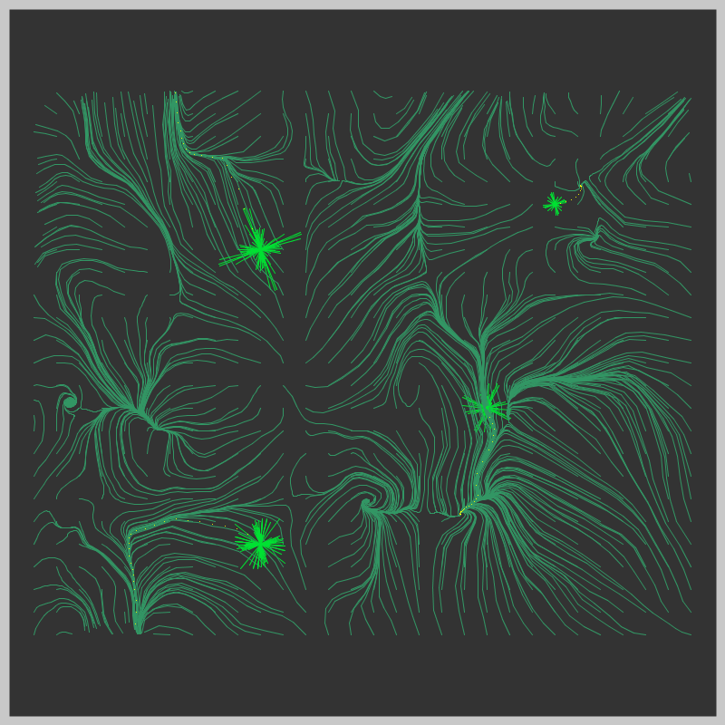
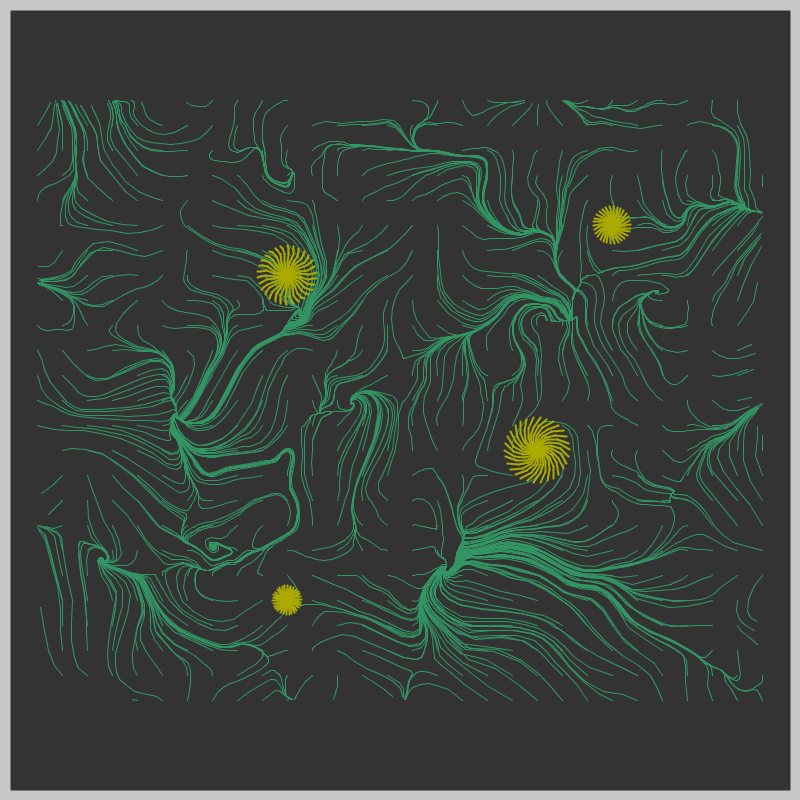

## Jan 04: Small areas of Symmetry

  

## Description

Used vector force fields (noise fields) to create a whole field of partciles. A handful of them are rotated to create small areas of symmetry.

- The Code can be [found here](.)

## Project Structure

- Art artifact (jpeg, png or gif)
- A brief description of the end product, and possibly the thinking behind it
- Some technical notes and challenges
- Code
- References, if any

## Code and Common Modules
`noise_symmetry.py` is what you have to run to recreate these images.

For most of these, I am using the `Processing` Framework. Since I mostly code in Python, I use [the Python extension of Processing](https://py.processing.org/reference/), which is not as popular as its Java version. Also, I sometimes create small resuable code segments
which I use in multiple projects. I'm sharing all my genart code, in case others find it useful.

Ram