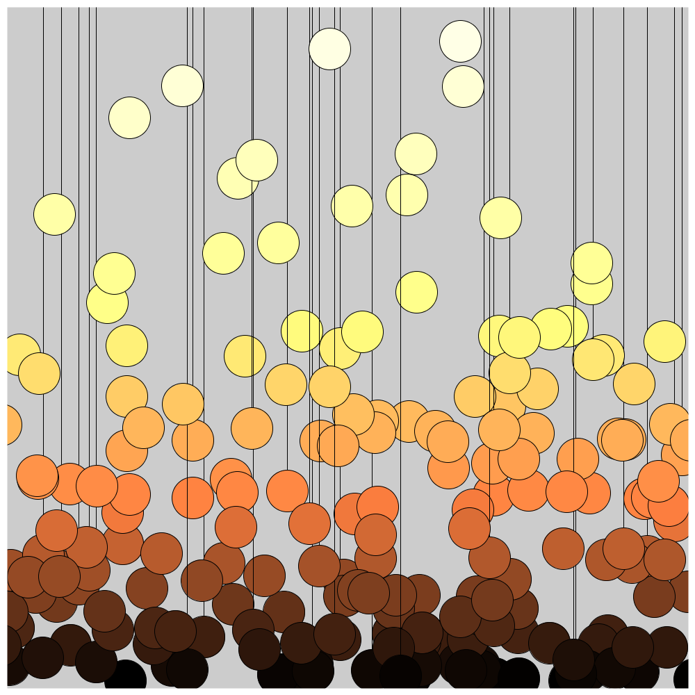
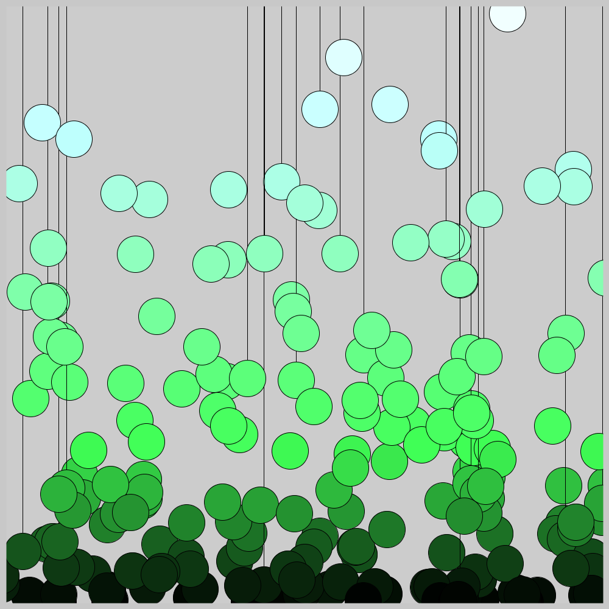
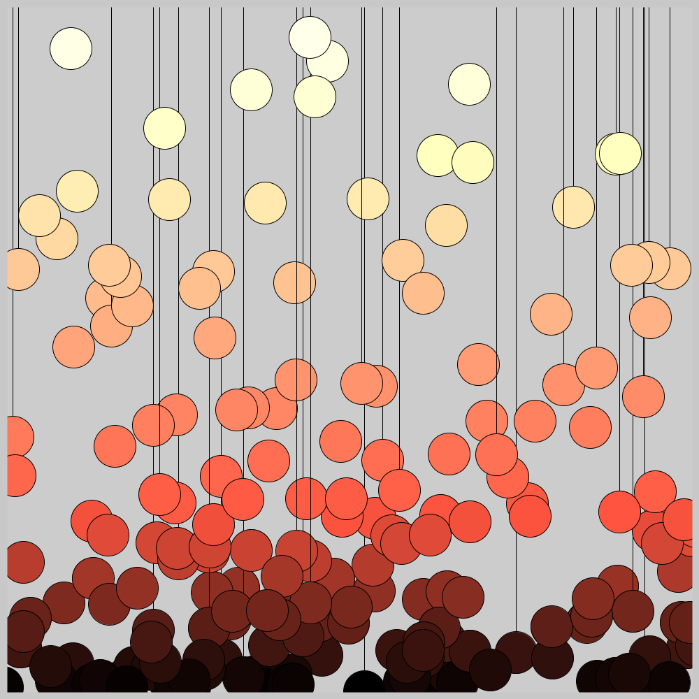

## Jan 05: Code Golf

  


## Description

Randomly scatter colored balls, with increasing density closer to the "ground." Added connecting lines from the top to 3% of the balls, for a chandelier or suspended effect. The color of the balls is also dependent on their y-coordinate. Do the above, using 10 lines of code.

```
def setup():
    size(w, w)
    for _ in range(w):
        s, c = random(w), random(_)
        fill(c, c / 2, c / 4)
        flip = random(1)
        if flip > 0.97:
            line(w - s, 0, w - s, w - c)
        if flip > 0.8:
            ellipse(w - s, w - c - 20, r, r)
```

- The Code can be [found here](.)


## Project Structure

- Art artifact (jpeg, png or gif)
- A brief description of the end product, and possibly the thinking behind it
- Some technical notes and challenges
- Code
- References, if any



## Code and Common Modules
`golf1.py` is what you have to run to recreate these images.

For most of these, I am using the `Processing` Framework. Since I mostly code in Python, I use [the Python extension of Processing](https://py.processing.org/reference/), which is not as popular as its Java version. Also, I sometimes create small resuable code segments which I use in multiple projects. I'm sharing all my genart code, in case others find it useful.

Ram