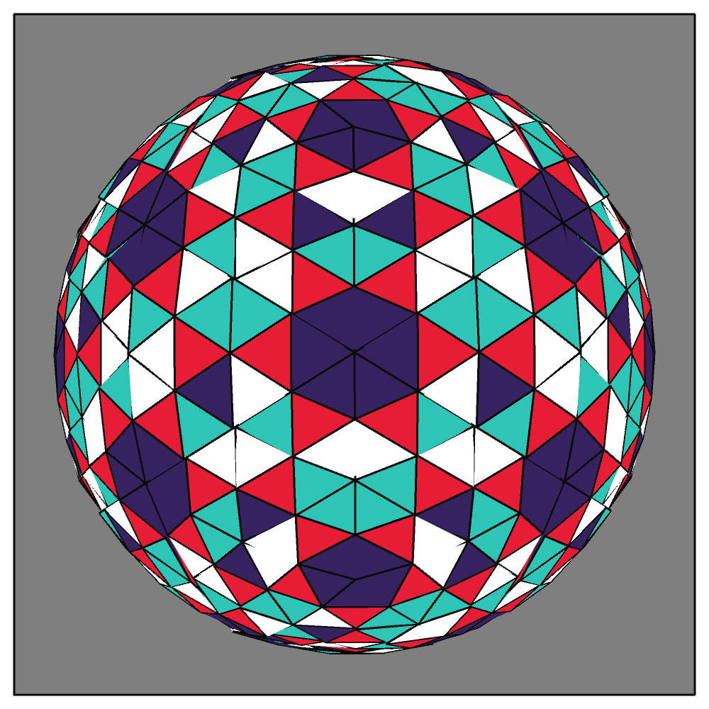
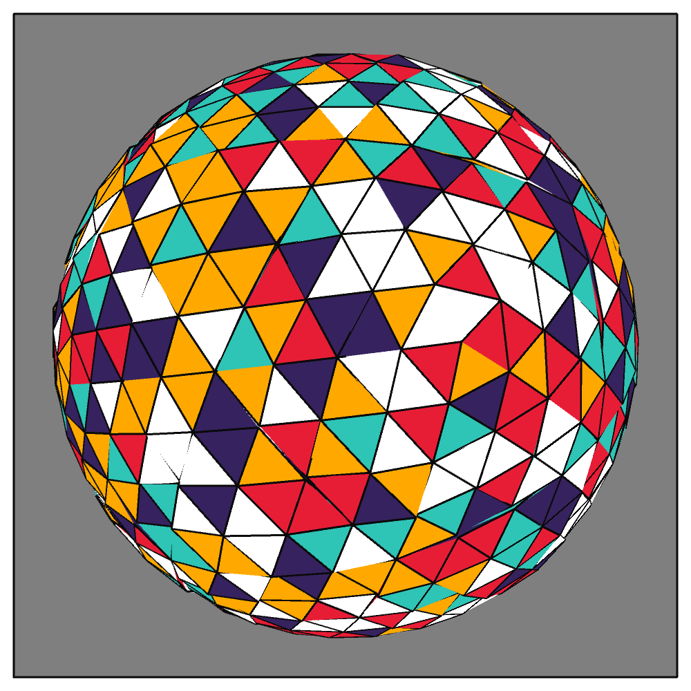

## Jan 06: Triangle Subdivision

  
  

Find other images [here](images)
## Description

Start with a 20-sided icosahedron. Subdivide each triangular face into smaller triangles. Project the vertices of all the resulting smaller triangles on to a sphere. Add rotation.

- The Code can be [found here](.)

## Project Structure

- Art artifact (jpeg, png or gif)
- A brief description of the end product, and possibly the thinking behind it
- Some technical notes and challenges
- Code
- References, if any

     
  

## Reference
Pages on Icosahedron creation

- https://en.wikipedia.org/wiki/Geodesic_polyhedron
- https://www.openprocessing.org/sketch/1045966

  

## Code and Common Modules
`icosahedron.py` is what you have to run (from inside Processing) to recreate these images.

For most of these, I am using the `Processing` Framework. Since I mostly code in Python, I use [the Python extension of Processing](https://py.processing.org/reference/), which is not as popular as its Java version. Also, I sometimes create small resuable code segments
which I use in multiple projects. I'm sharing all my genart code, in case others find it useful.

  

Ram

