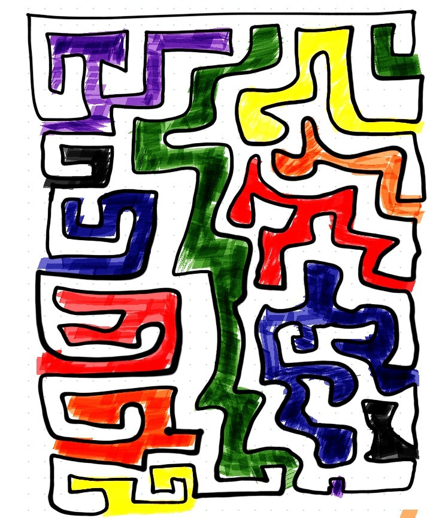
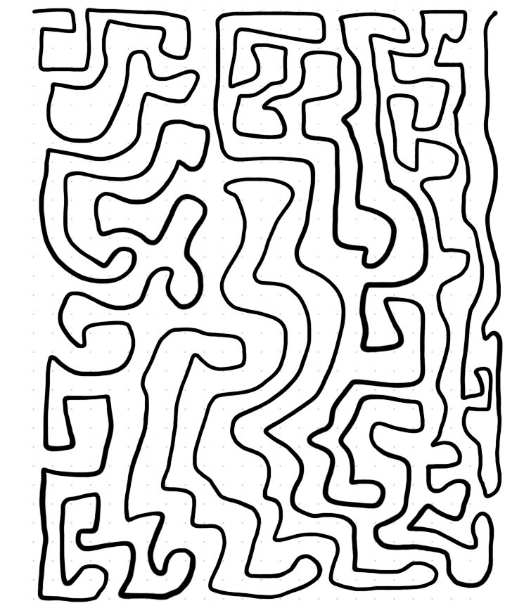
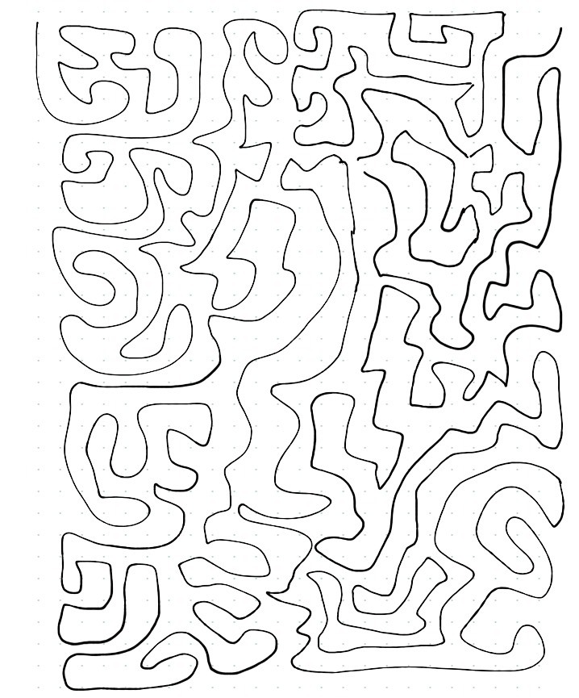

## Jan 07 Prompt: Generate some rules, Hand draw on Paper

  

## Description

The prompt was to come up with our own rules. This turns out to be trickier than
might first appear. I thought of some rules that might be more 'difficult' for GenArt
and came up with the following rules:
  

Rules: 
1. Cover area with a single loop/line that never intersects itself. 
2. Bonus points for uniform spacing 
3. Bonus points for non uniform patterns. 

No code for today's prompt, just some doodling.

Note: Instead of drawing on paper, I drew in on my tablet.

  
  

Ram

