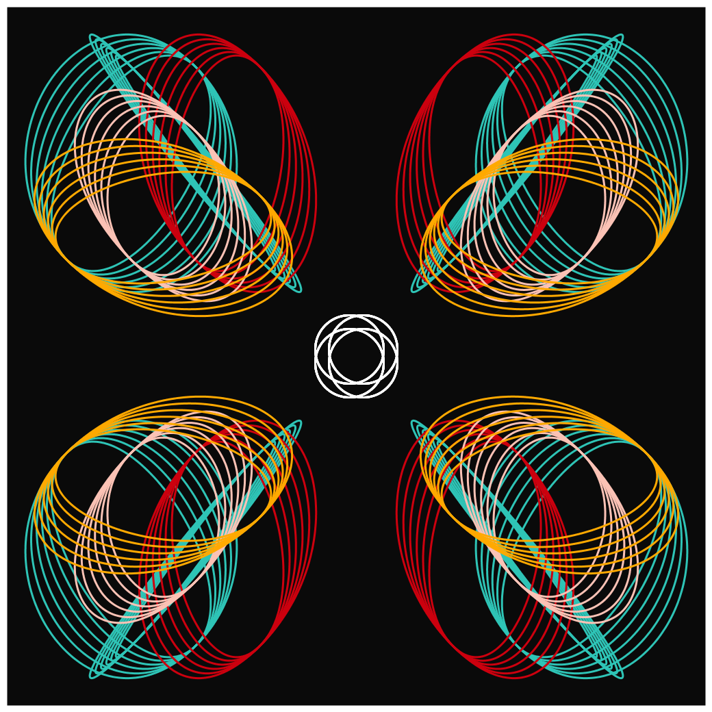
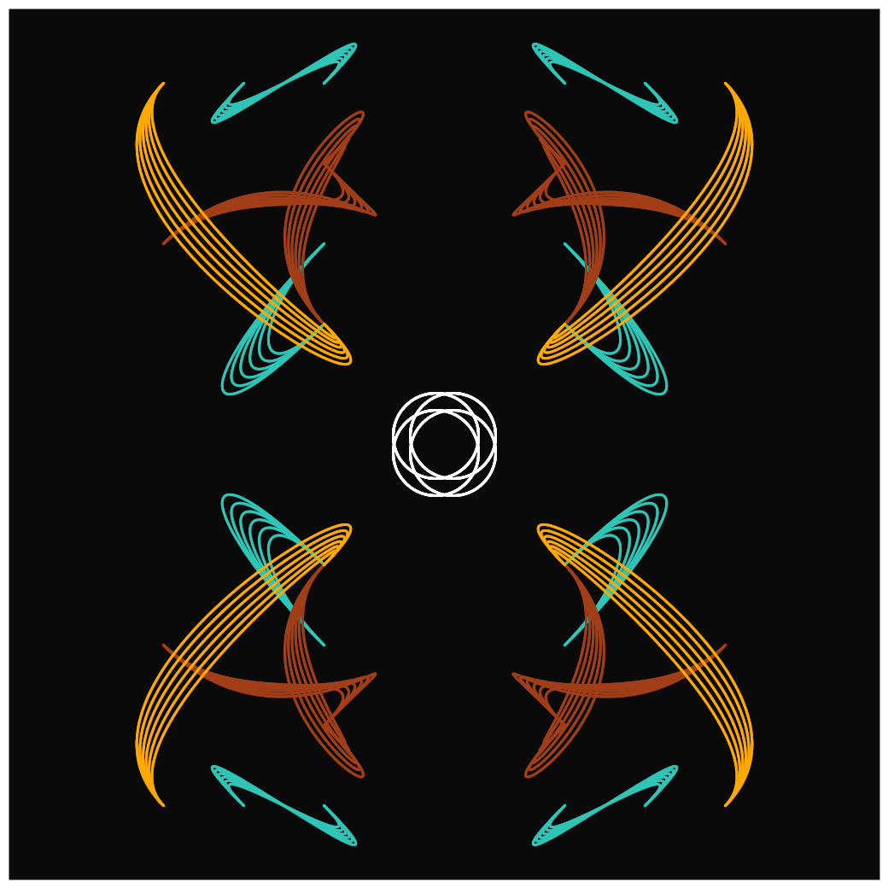
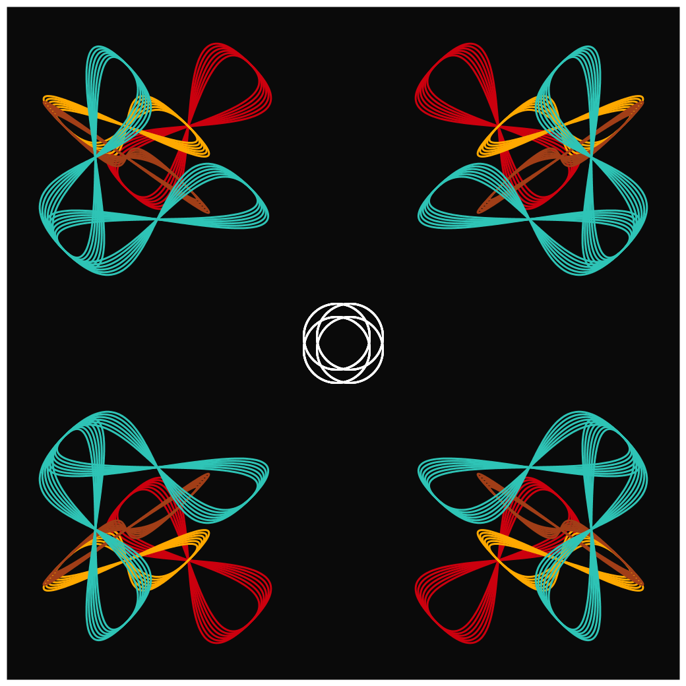
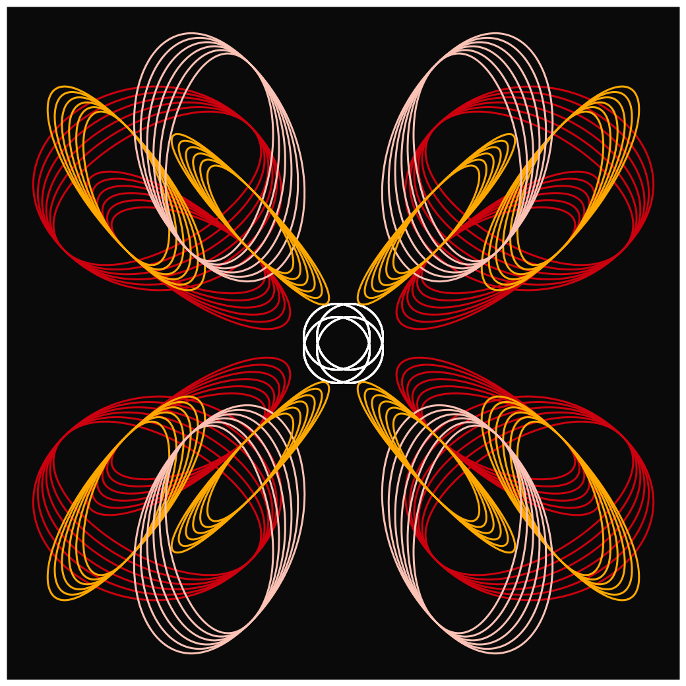
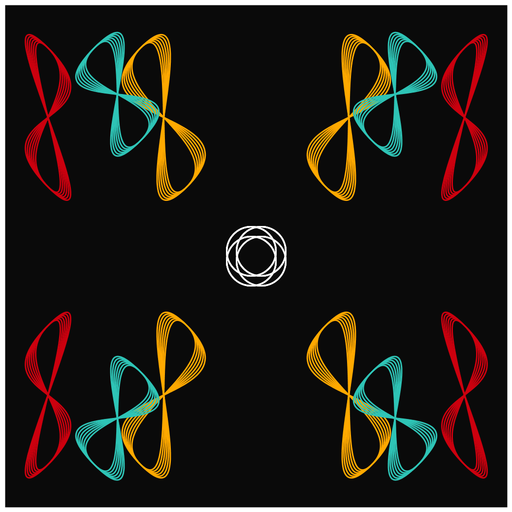

## Jan 08: Curve Only

  
  

Find other images [here](images)
## Description

In a small grid, choose 2 points and draw several Bezier curves between them, varying each one slightly to create ripple effects.
Rotate and reflect 4-way to create symmetrical curves.

- The Code can be [found here](.)

  
     
  

## Reference

- https://en.wikipedia.org/wiki/B%C3%A9zier_curve

  

## Code and Common Modules
`curve1.py` is what you have to run (from inside Processing) to recreate these images.

For most of these, I am using the `Processing` Framework. Since I mostly code in Python, I use [the Python extension of Processing](https://py.processing.org/reference/), which is not as popular as its Java version. Also, I sometimes create small resuable code segments
which I use in multiple projects. I'm sharing all my genart code, in case others find it useful.

  
  

Ram

