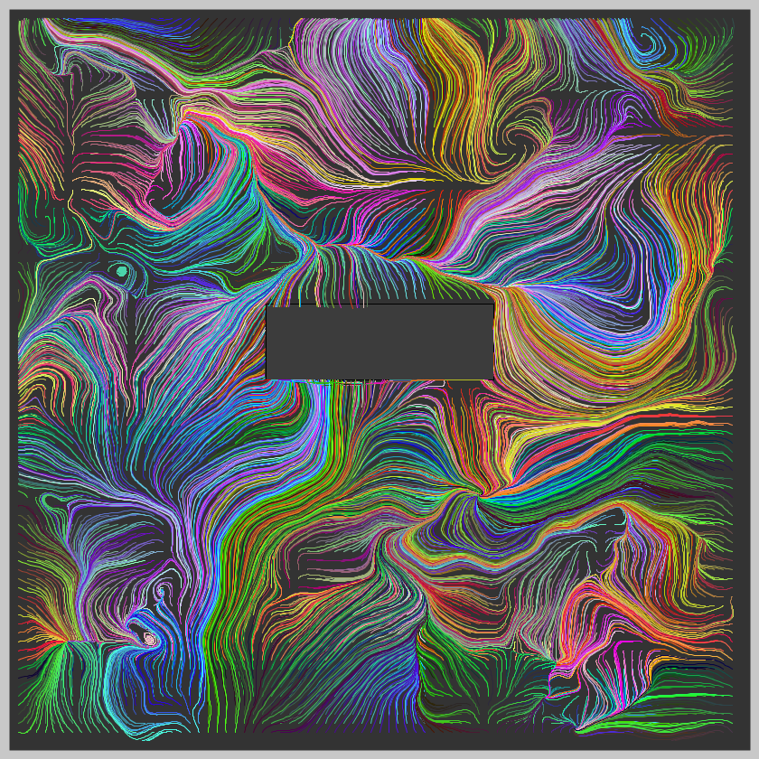
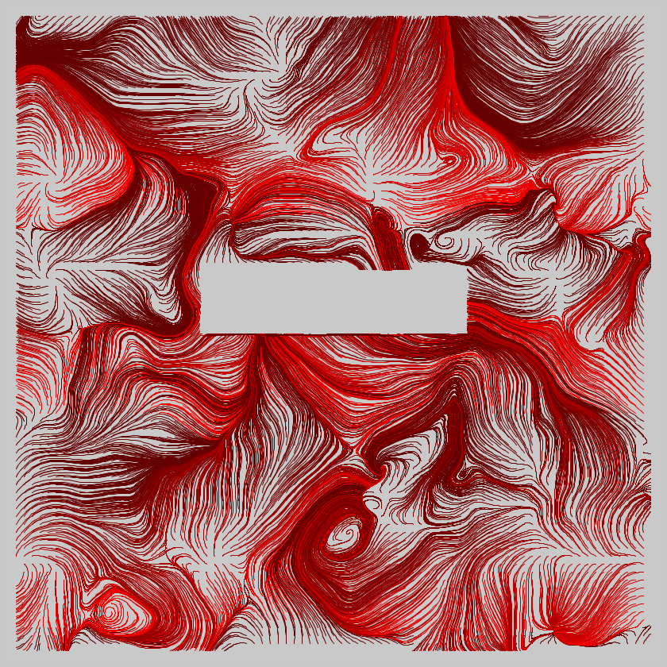
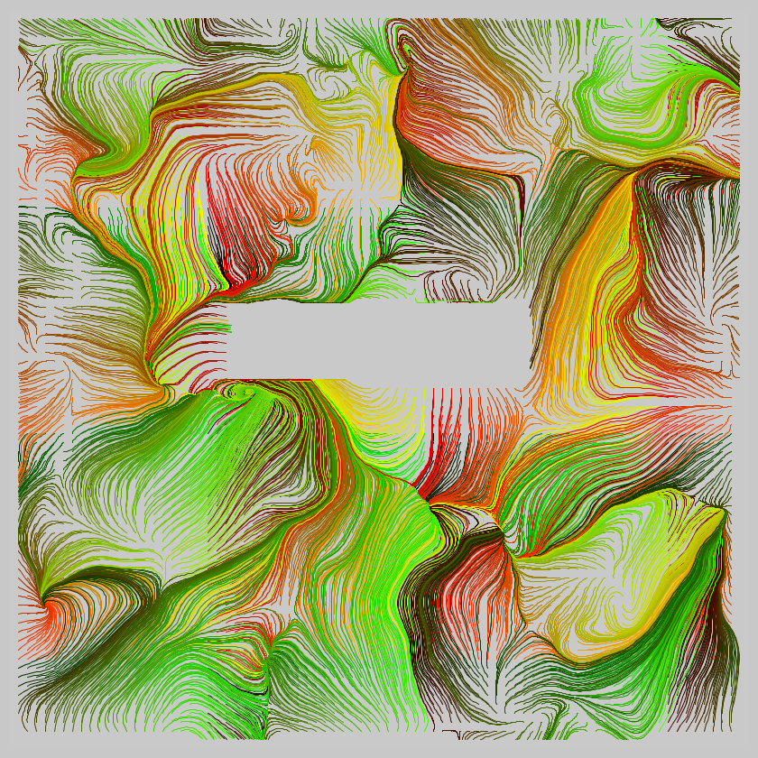
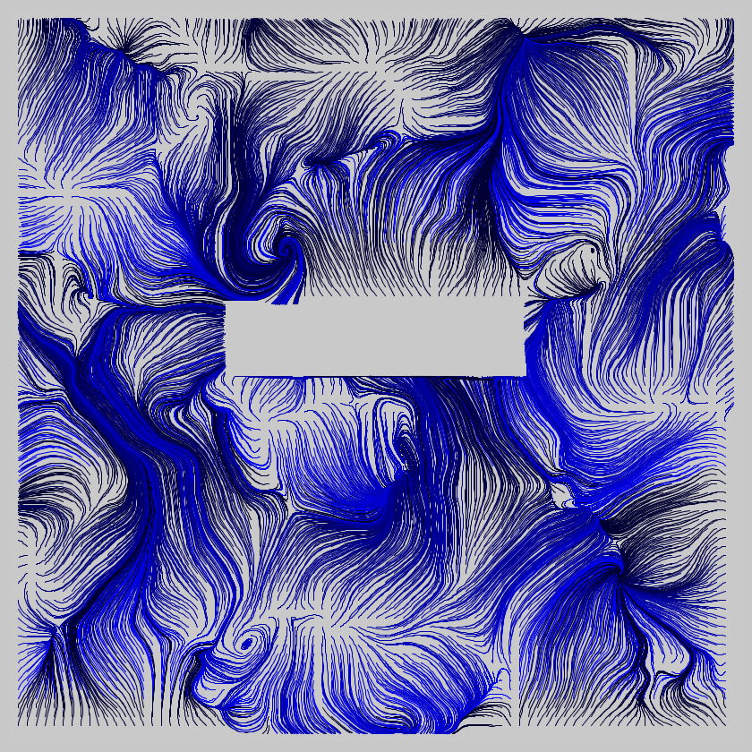

## Jan 09: Interference Patterns

  
  

Find other images [here](images)

## Description

Using vector force fields (noise fields) to create a whole field of particles, divert them around a rectangular
interference box placed in the middle.

  

## Technical

- Created a rectangular box, and a function to see if any particle (point) was within it.
- When a force field "touched" the interference box, (close to box wall), modify the force field _along_ the wall, instead of allowing it inside. 
- That creates the interference effect.

- The Code can be [found here](.)

  

## Code and Common Modules
`interference.py` is what you have to run to recreate these images.
Run this from _inside_ the Processing IDE, since it uses Processing.

For most of these, I am using the `Processing` Framework. Since I mostly code in Python, I use [the Python extension of Processing](https://py.processing.org/reference/), which is not as popular as its Java version. Also, I sometimes create small resuable code segments which I use in multiple projects. I'm sharing all my genart code, in case others find it useful.

Ram

  
