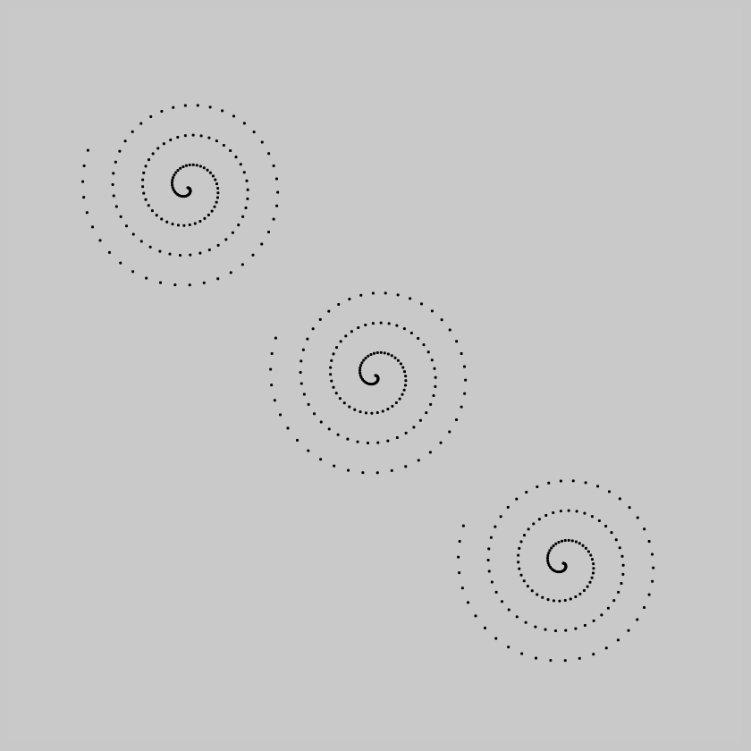
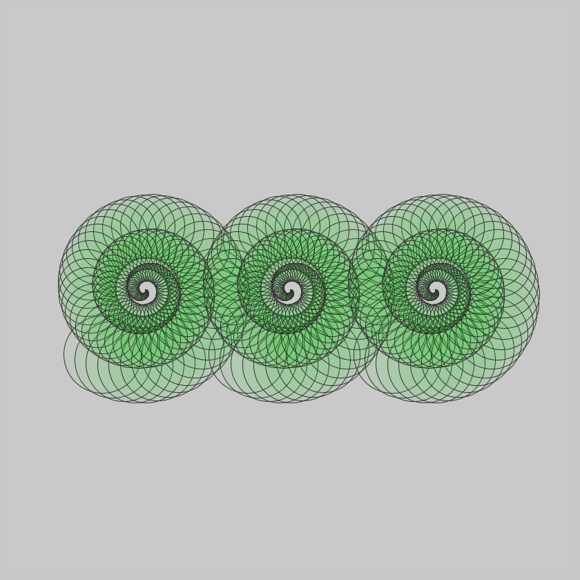
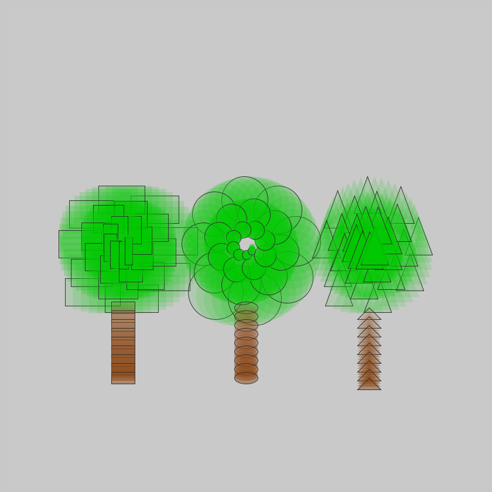

## Jan 10: Tree
  

  

Find other images [here](images)

## Description

Using purely geometric shapes (ellipse, rectangle, triangle) draw three trees. The foliage (leaves) is a reverse spiral,
with the geom's radius shrinking as well.

  

- The Code can be [found here](.)

  

## Technical

I started with a spiral. Reversed it, and then used the points as centers to places the geoms (rectangles, ellipses).

## Code and Common Modules
`tree1.py` is what you have to run to recreate these images.
Run this from _inside_ the Processing IDE, since it uses Processing.

For most of these, I am using the `Processing` Framework. Since I mostly code in Python, I use [the Python extension of Processing](https://py.processing.org/reference/), which is not as popular as its Java version. Also, I sometimes create small resuable code segments which I use in multiple projects. I'm sharing all my genart code, in case others find it useful.

Ram

  
