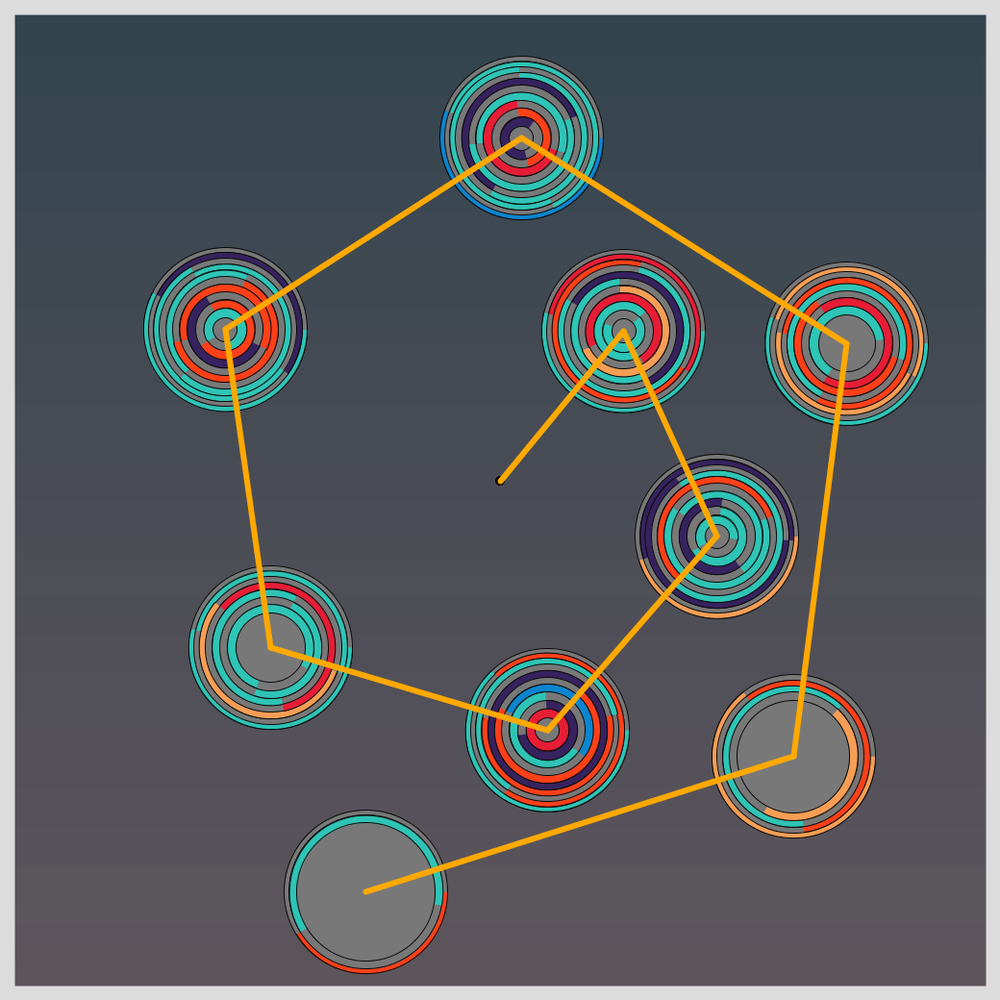

## Jan 11: Non-computer Autonomous Process
  

Find other images [here](images)

## Description

Top 10 Hit Songs (Rock 'n Roll) from each year, as a source of numbers. Each year is one set of concentric bubbles, with song duration (for length of arcs), the genres for the colors, and song rank for position within the year bubble. The year bubbles (2011-2019) are placed in a spiral.

  

- The Code can be [found here](.)
- The data directory has all the CSV files, for you to download and use.

## Technical

Used a Jupyter Notebook to get the data to be in the shape I wanted it. I was only interested in 4 variables: `Year` of the hit Song, its `Rank`, its `duration` and its `Genre.`

Used `Python Pandas` to merge and get my dataset ready. Find the simplified and cleaned[data set here](songs.csv).

## References

- Top Ten for Each Year comes from: https://digitaldreamdoor.com/pages/best_songs2010-2019-top-ten.html
- https://github.com/taubergm/Billboard-Spotify-Lyrics-Music-analysis
- John Henry Penrose has done a nice analysis, and shared the cleaned dataset. http://student.elon.edu/jhenrypenrose/billboard/

## Code and Common Modules
`songs_spiral.py` is what you have to run to recreate these images.
Run this from _inside_ the Processing IDE, since it uses Processing.

For most of these, I am using the `Processing` Framework. Since I mostly code in Python, I use [the Python extension of Processing](https://py.processing.org/reference/), which is not as popular as its Java version. Also, I sometimes create small resuable code segments which I use in multiple projects. I'm sharing all my genart code, in case others find it useful.

Ram

  
