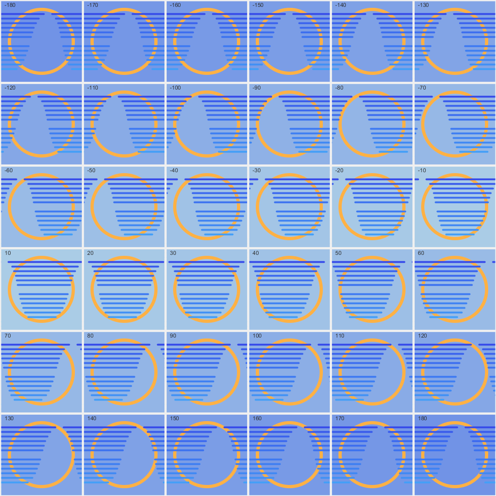

## Jan 12: Public API to create Art
  

API Used: https://sunrise-sunset.org/api

## Description

Used an API to get sunrise & sunset times for a grid of lat/longs. For each of the 36 major meridians,Plot line-lengths corresponding to the hours of daylight on Jan 12, 2021. https://sunrise-sunset.org/api

- The Code can be [found here](.)

## Technical

Used a Jupyter Notebook to get the data to be in the shape I wanted it. 
- The Jupyter Notebook has the code to access data using the API. (Public, no OAuth required).

- To make it easy for myself, I created a `timings` list in Python and copied it to the Processing code. Look at the bottom of `public_api.py`

## References

API Used: https://sunrise-sunset.org/api

## Code and Common Modules
`public_api.py` is what you have to run to recreate these images.
Run this from _inside_ the Processing IDE, since it uses Processing.

For most of these, I am using the `Processing` Framework. Since I mostly code in Python, I use [the Python extension of Processing](https://py.processing.org/reference/), which is not as popular as its Java version. Also, I sometimes create small resuable code segments which I use in multiple projects. I'm sharing all my genart code, in case others find it useful.

Ram