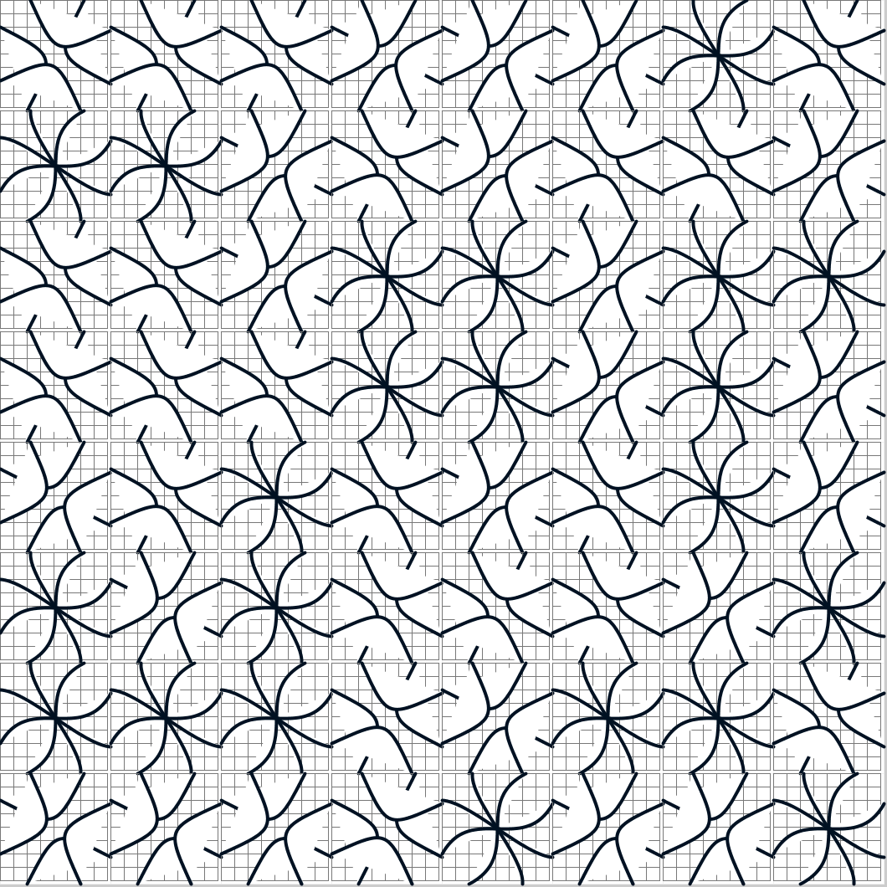
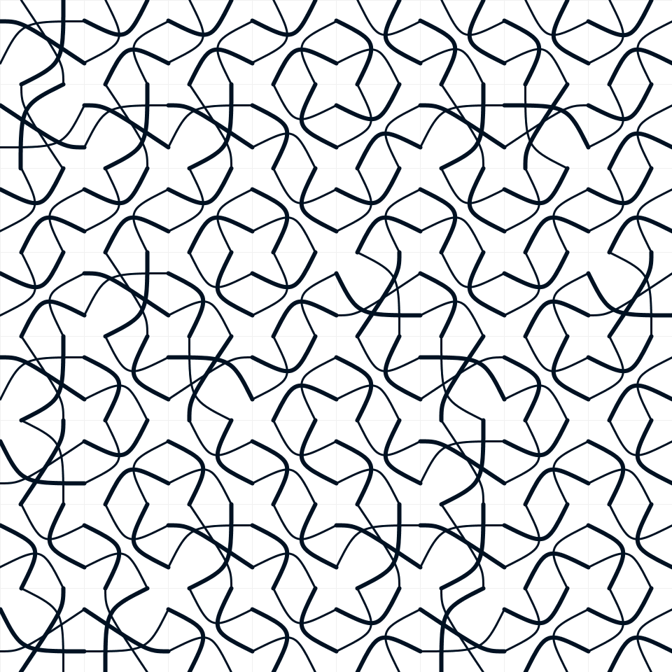

## Description

Escher-Tiles are created with a bit of randomness mixed in. They are then rotated randomly by a few sets of 90 degrees and rendered on an 8x8 grid.

- The Code can be [found here](.)

## Technical

- Each tile has 8 entry points, 2 in each side.
- Each Tile is subdivided into an 8x8 mesh. 
- Using this mesh, Bezier curves are drawn from one "junction" of Entry point in a tile to another.
- Use random numbers to rotate the tiles by 0, 90, 180, or 270 degrees.

  

## References

- http://archive.bridgesmathart.org/2020/bridges2020-191.pdf

## Code and Common Modules
`non_repeating_tiles.py` is what you have to run to recreate these images.
Run this from _inside_ the Processing IDE, since it uses Processing.

For most of these, I am using the `Processing` Framework. Since I mostly code in Python, I use [the Python extension of Processing](https://py.processing.org/reference/), which is not as popular as its Java version. Also, I sometimes create small resuable code segments which I use in multiple projects. I'm sharing all my genart code, in case others find it useful.

Ram

  

