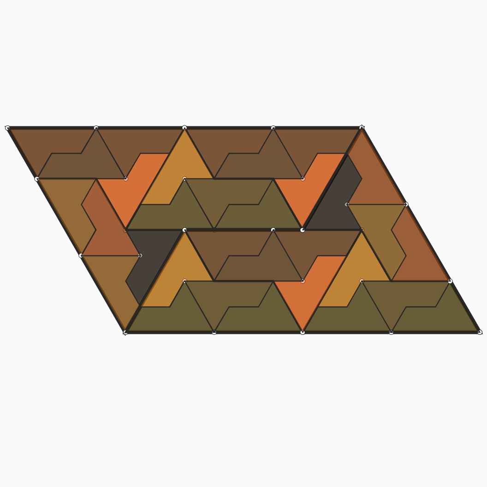

# Jan 14 - Subdivision of Sphinx Tiles

## Description
  

Create a couple of Sphinx tiles, and subdivide them. The color of each subdivision is based on its chirality and orientation.

- The Code can be [found here](.)

  

## References

- https://tilings.math.uni-bielefeld.de/substitution/sphinx/
- https://en.wikipedia.org/wiki/Sphinx_tiling
- http://www.geoaustralia.com/english/Sphinx/Guide.html

  

## Code and Common Modules
`non_repeating_tiles.py` is what you have to run to recreate these images.
Run this from _inside_ the Processing IDE, since it uses Processing.

For most of these, I am using the `Processing` Framework. Since I mostly code in Python, I use [the Python extension of Processing](https://py.processing.org/reference/), which is not as popular as its Java version. Also, I sometimes create small resuable code segments which I use in multiple projects. I'm sharing all my genart code, in case others find it useful.

Ram

  

