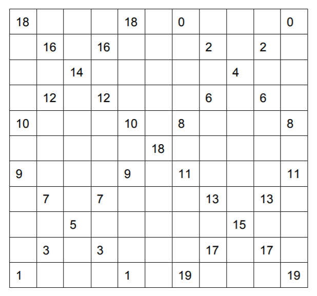
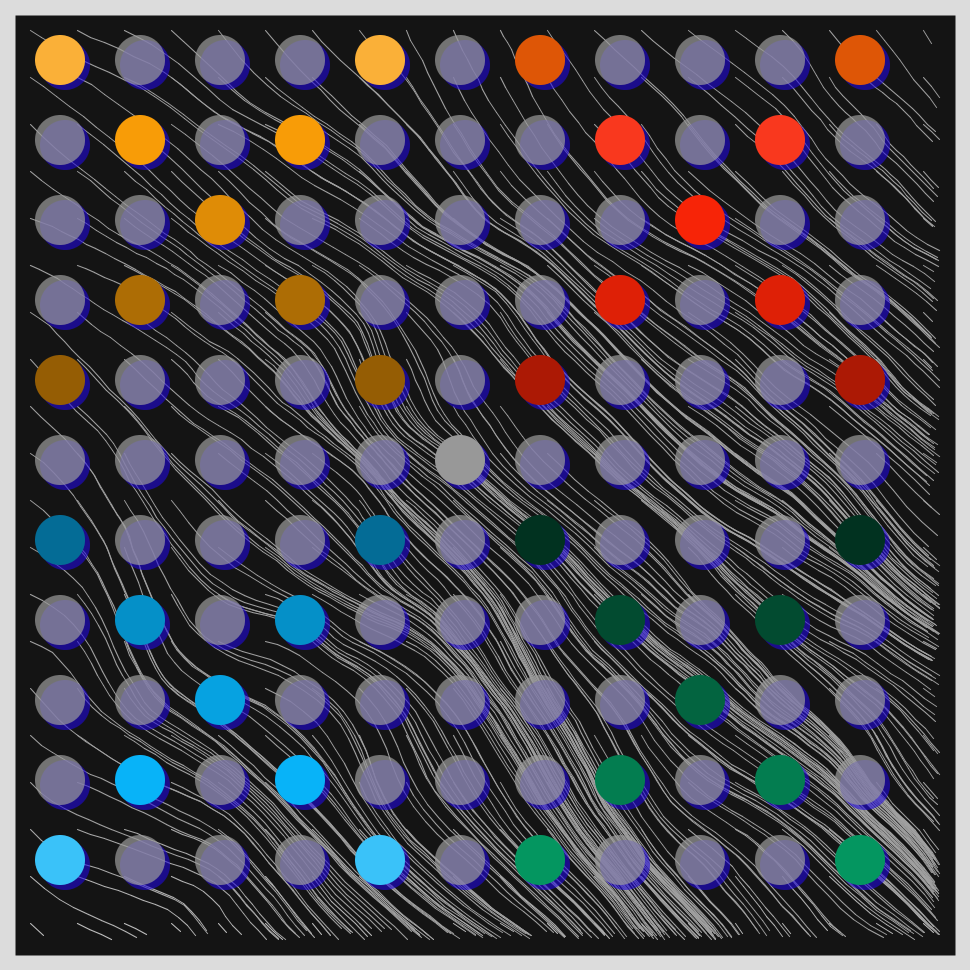
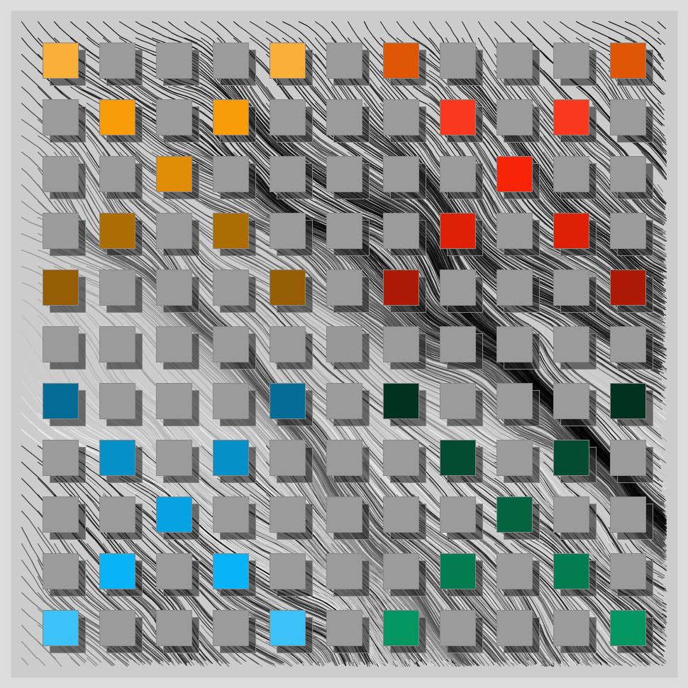

# Jan 15 Mayan Squares - Following Jensen's Rules

  

## Description
Use Alfred Jensen's 'Mayan Square' to decide colors for a 11x11 grid. Drawn over a force field.

- The Code can be [found here](.)

## Technical

I followed the rules of a "Mayan Color Square" laid out by Alfred Jensen. (Also, see References below)

  

- Needed 21 different colors. I decided to use 2 palettes of 10 colors each.
10 Hot colors and 10 cold colors.

## References

- http://www.artnet.com/artists/alfred-jensen-2/
- http://s3.amazonaws.com/arena-attachments/1501042/b6a597b159ef1d127144fa7bc4605cfb.pdf?1513036272

  

## Code and Common Modules
`mayan_squares.py` is what you have to run to recreate these images.
Run this from _inside_ the Processing IDE, since it uses Processing.

For most of these, I am using the `Processing` Framework. Since I mostly code in Python, I use [the Python extension of Processing](https://py.processing.org/reference/), which is not as popular as its Java version. Also, I sometimes create small resuable code segments which I use in multiple projects. I'm sharing all my genart code, in case others find it useful.

Ram

  

