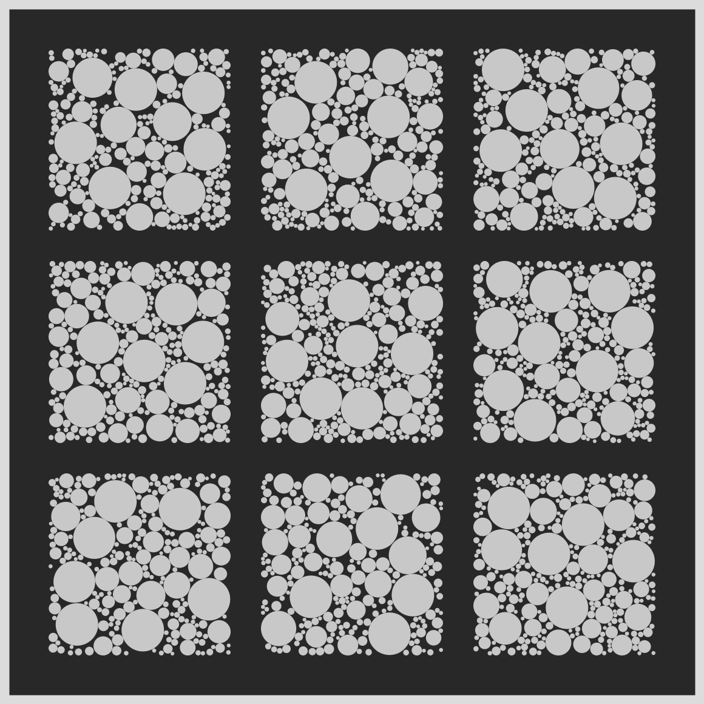
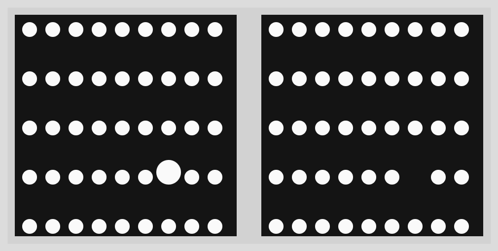

# Jan 16 Circles Only

  

## Description

- The Code can be [found here](.)

## Technical

- In addition to regular circle-packing (see reference below) by comparing each circle's potential radius against the square panel's walls, I made sure that they all circles stayed within the bounding box.

## References

- [Here's a good reference on Circle Packing](https://thecodingtrain.com/CodingChallenges/050.1-circlepackinganimated.html)

  

## Code and Common Modules
`circles1.py` is what you have to run to recreate these images.
Run this from _inside_ the Processing IDE, since it uses Processing.

For most of these, I am using the `Processing` Framework. Since I mostly code in Python, I use [the Python extension of Processing](https://py.processing.org/reference/), which is not as popular as its Java version. Also, I sometimes create small resuable code segments which I use in multiple projects. I'm sharing all my genart code, in case others find it useful.

Ram

This was a "throwaway" piece. I wanted to create something quickly.

  

