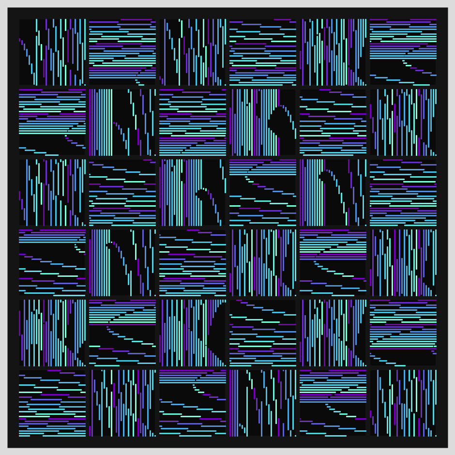
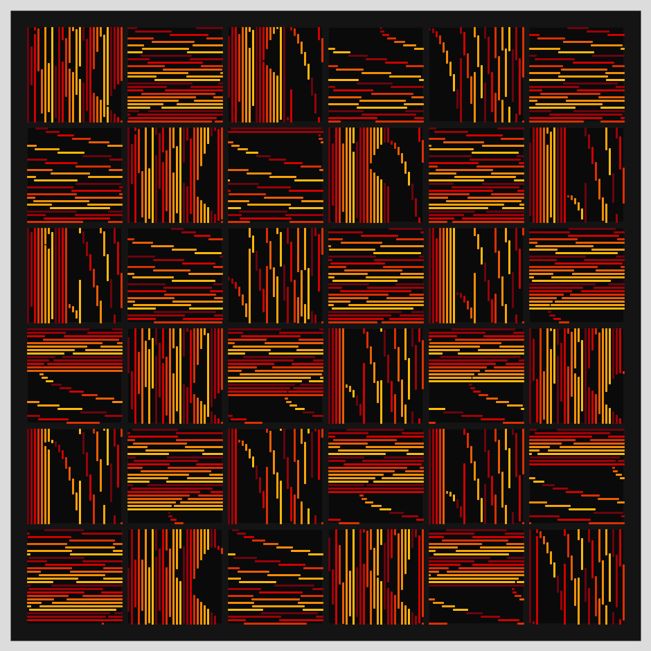
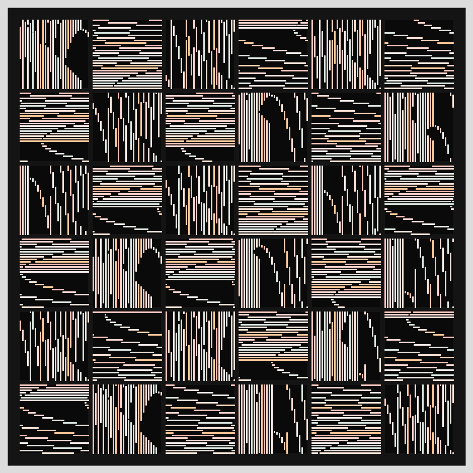
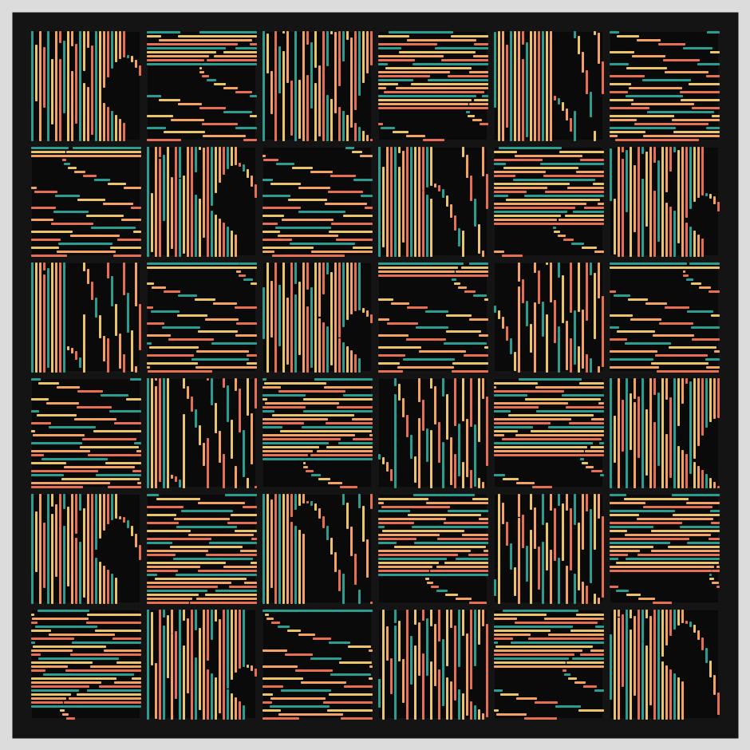

# Jan 17 -Prompt: Draw a line, pick a new color, move a bit. 

  

## Description

I constrained the lines to stay within one of 36 (6x6) panels. The colors rotate through a palette of colors.

- The Code can be [found here](.)

  
## Technical

- Each line (within a panel) is slightly longer that its previous one. Once the line length reaches the panel's dimension, it gets reset.
- I alternate the orientations to be vertical and horizontal.

  

## Code and Common Modules
`line_color_move.py` is what you have to run to recreate these images.
Run this from _inside_ the Processing IDE, since it uses Processing.

For most of these, I am using the `Processing` Framework. Since I mostly code in Python, I use [the Python extension of Processing](https://py.processing.org/reference/), which is not as popular as its Java version. Also, I sometimes create small resuable code segments which I use in multiple projects. I'm sharing all my genart code, in case others find it useful.

Ram

This was a "throwaway" piece. I wanted to create something quickly.

  

