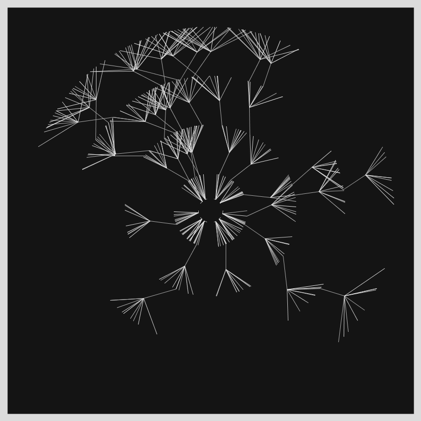
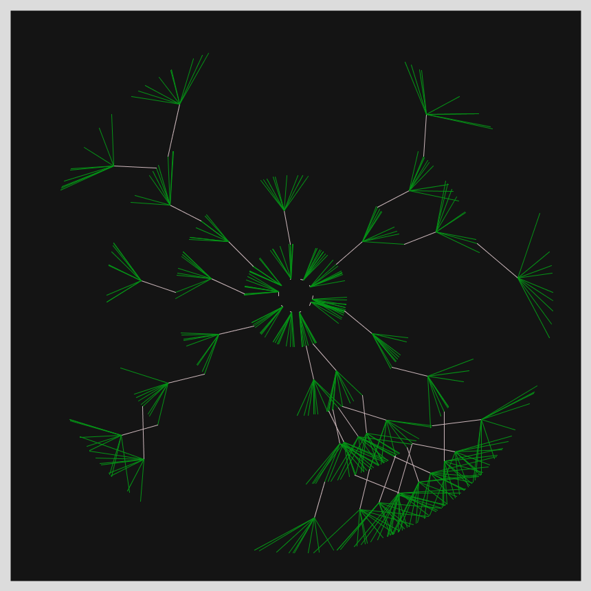
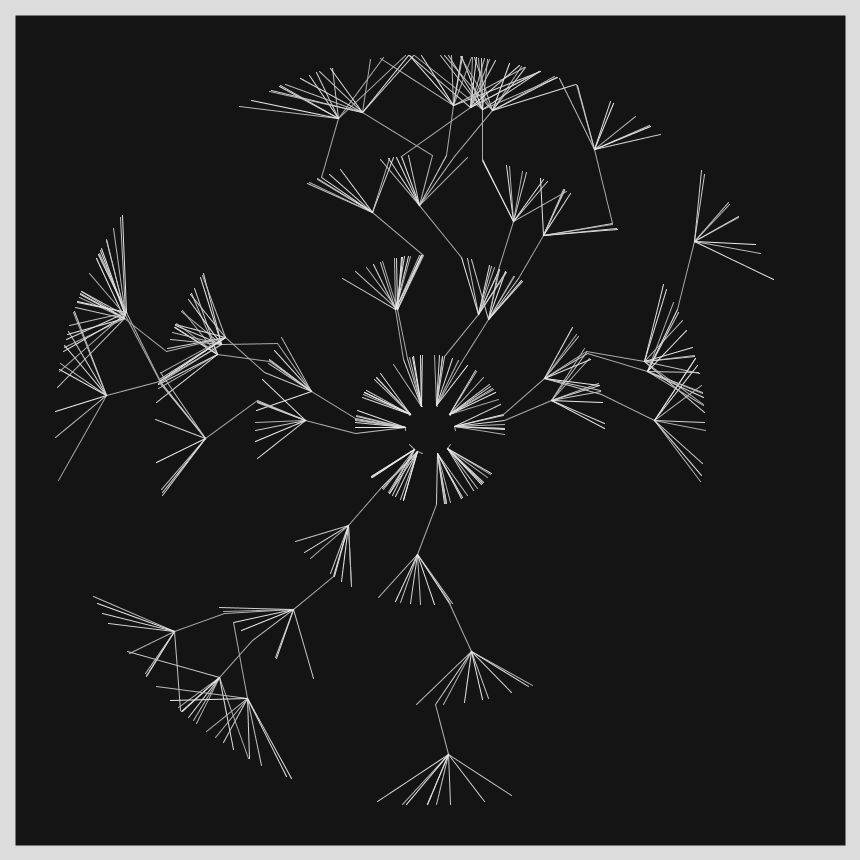
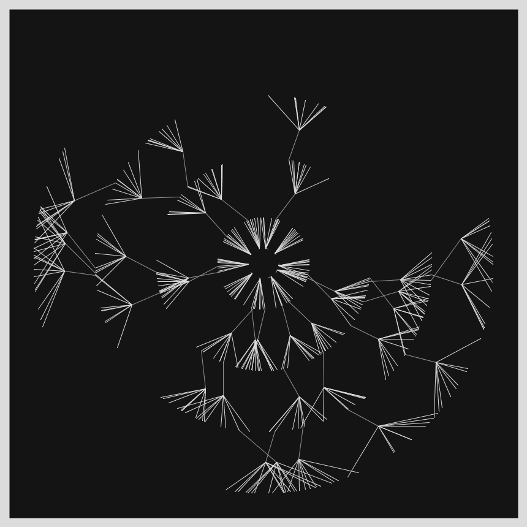

# Jan 18 - Prompt: One process grows, another process prunes.

  
  

Other images can be found [here](images)
## Description

An attempt to convey 'growth and pruning' in one image, without resorting to animation. All my initial ideas involved animation. After some doodling, settled on this idea of alternating growth cycles with a pruning step. These concentric rings serve as pruning filters after each growth spurt. 

- The Code can be [found here](.)

  

## Technical

- The only thing that actually gets drawn is a line.
- Each line has one end at a "fixed point" and the other end touches an imaginary circle. 
- The radius of these circles (alternating rings of growth and pruning) keep increasing at each level.
- I pick a random direction (theta) and use polar cordinate ideas to get the x,y for where it intersects.
- One trick I used is to remember the current theta of each point, so that I can perturb it slightly. This worked fine.

  

## Code and Common Modules
`grow_and_prune.py` is what you have to run to recreate these images.
Run this from _inside_ the Processing IDE, since it uses Processing.

For most of these, I am using the `Processing` Framework. Since I mostly code in Python, I use [the Python extension of Processing](https://py.processing.org/reference/), which is not as popular as its Java version. Also, I sometimes create small resuable code segments which I use in multiple projects. I'm sharing all my genart code, in case others find it useful.

Ram

This was a "throwaway" piece. I wanted to create something quickly.

  

