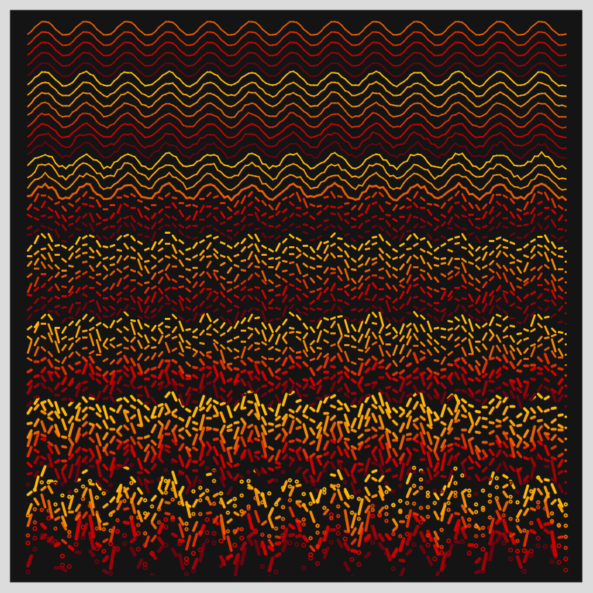
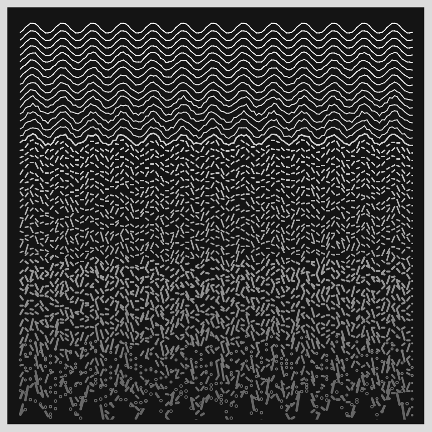
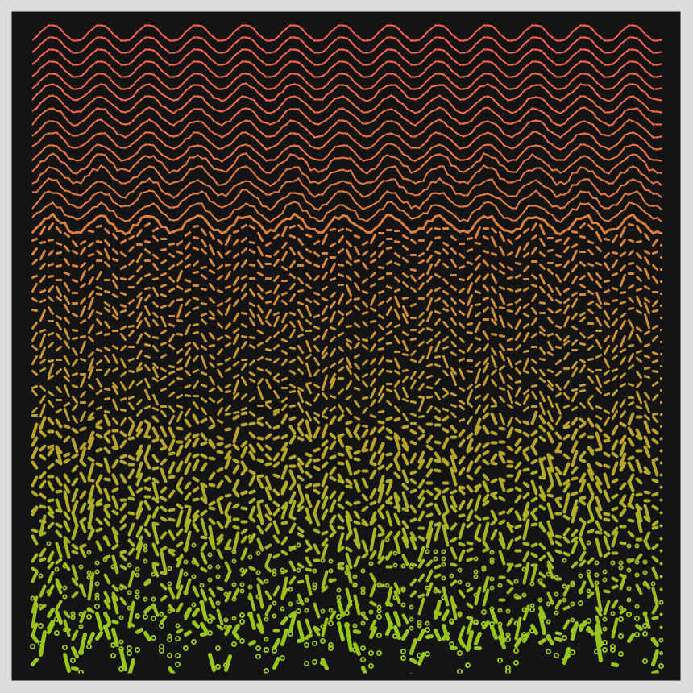
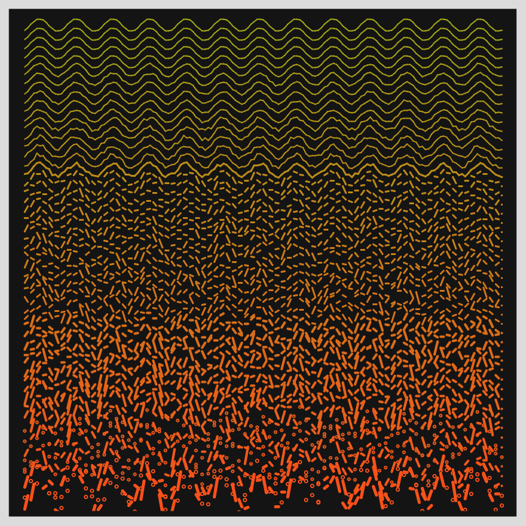

# Jan 19 - Prompt: Increase the randomness along the Y-axis.

  

Other images can be found [here](images)
## Description

Start with a simple, clean sine wave, and progressive add noise and randomness, including rupturing the sine curve, all of which increase along the Y-axis.

- The Code can be [found here](.)

  

## Code and Common Modules
`yrandom.py` is what you have to run to recreate these images.
Run this from _inside_ the Processing IDE, since it uses Processing.

  

For most of these, I am using the `Processing` Framework. Since I mostly code in Python, I use [the Python extension of Processing](https://py.processing.org/reference/), which is not as popular as its Java version. Also, I sometimes create small resuable code segments which I use in multiple projects. I'm sharing all my genart code, in case others find it useful.

Ram

  

