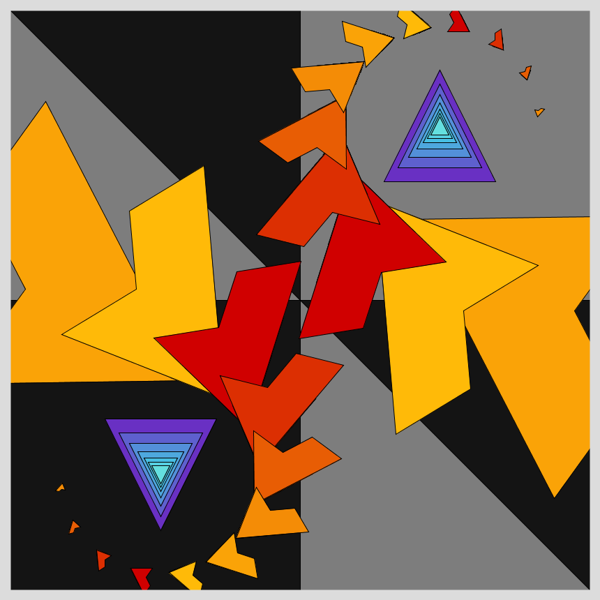

# Jan 21 - Prompt: Recursion

More specifically:

```
function f(x) { 
    DRAW(x); 
    f(1 * x / 4); 
    f(2 * x / 4); 
    f(3 * x / 4); 
}
```

  

## Description
Taking the prompt literally, coded it. And then experimented with several DRAW functions and shapes, big and small until I ran out of time. Added rotation to delineate the shapes.

- The Code can be [found here](.)

  


## Code and Common Modules
`recursion.py` is what you have to run to recreate these images.
Run this from _inside_ the Processing IDE, since it uses Processing.


For most of these, I am using the `Processing` Framework. Since I mostly code in Python, I use [the Python extension of Processing](https://py.processing.org/reference/), which is not as popular as its Java version. Also, I sometimes create small resuable code segments which I use in multiple projects. I'm sharing all my genart code, in case others find it useful.

Ram


