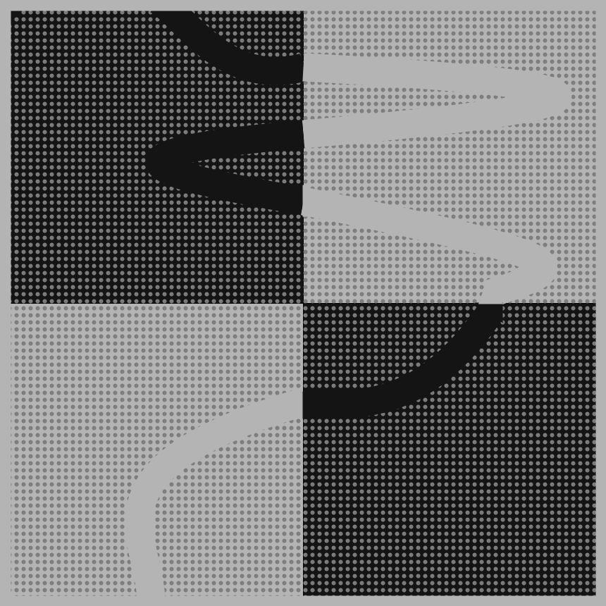

# Jan 22 - Prompt: Draw a line. Wrong answers only

  

## Description

Draw a line, but there is no line, but one is implied by the gaps in the dots.

- The Code can be [found here](.)

## Code and Common Modules
Run `not_a_line.py` to recreate these images. Please run this from _inside_ the Processing IDE, since it uses Processing.

For most of these, I am using the `Processing` Framework. Since I mostly code in Python, I use [the Python extension of Processing](https://py.processing.org/reference/), which is not as popular as its Java version. Also, I sometimes create small resuable code segments which I use in multiple projects. I'm sharing all my genart code, in case others find it useful.

Ram

