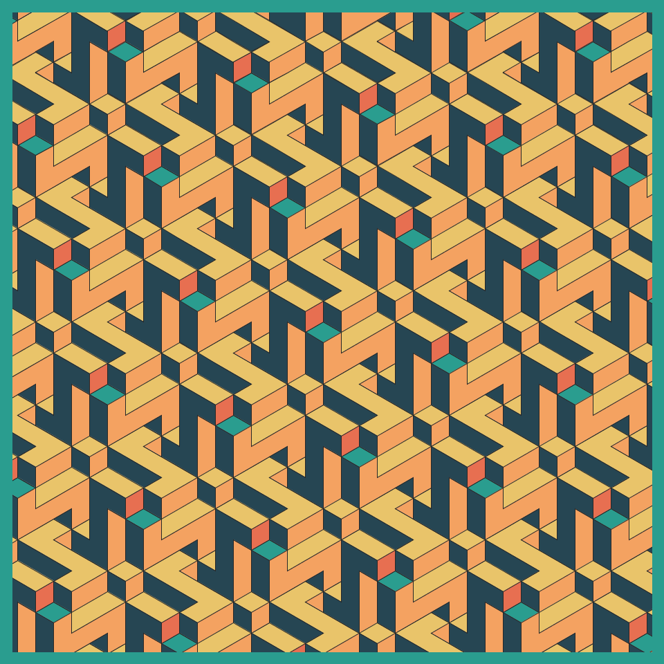
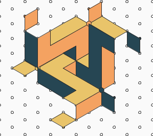
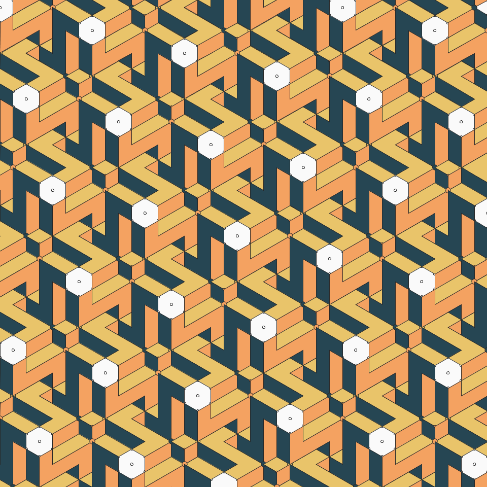
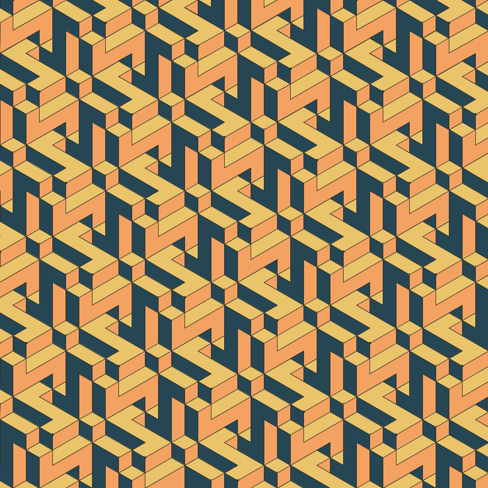

# Jan 23 - Prompt: #264653 #2a9d8f #e9c46a #f4a261 #e76f51, no gradients.

  

## Description

On a hexagonal (isometric) grid, use 3 colors to show the 3 planes that are orthogonal to each other. This results in an interlocking pattern. 

- The Code can be [found here](.)

## Technical

- Every hinges on getting the basic tile right. I ended up overly complicating things with this tile:

  

This can be simplified.
- Note that the grid has to of the "point-topped" hexagons type. Flat-topped won't work (at least not easily)

## Code and Common Modules
Run `interlocking.py` to recreate these images. Please run this from _inside_ the Processing IDE, since it uses Processing.

For most of these, I am using the `Processing` Framework. Since I mostly code in Python, I use [the Python extension of Processing](https://py.processing.org/reference/), which is not as popular as its Java version. Also, I sometimes create small resuable code segments which I use in multiple projects. I'm sharing all my genart code, in case others find it useful.

Ram

  
  

