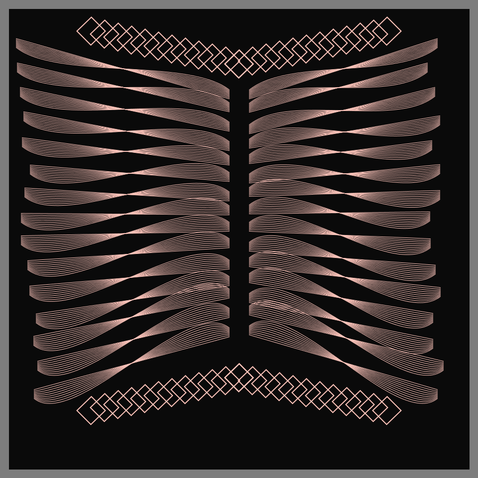

# Jan 23 - Prompt: 500 Lines

  

## Description

15 pairs of points x 10 flipped Bezier curves x 2 = 300. 25 squares x 4 sides x 2 = 200 --> 500 Lines.

- The Code can be [found here](.)

Link to all of my [Genuary2021 Creations](https://ram-n.github.io/Genuary_2021/).

  

## Code and Common Modules
Run `500_lines.py` to recreate these images. Please run this from _inside_ the Processing IDE, since it uses Processing.

For most of these, I am using the `Processing` Framework. Since I mostly code in Python, I use [the Python extension of Processing](https://py.processing.org/reference/), which is not as popular as its Java version. Also, I sometimes create small resuable code segments which I use in multiple projects. I'm sharing all my genart code, in case others find it useful.

Ram

  

Link to all of my [Genuary2021 Creations](https://ram-n.github.io/Genuary_2021/).

