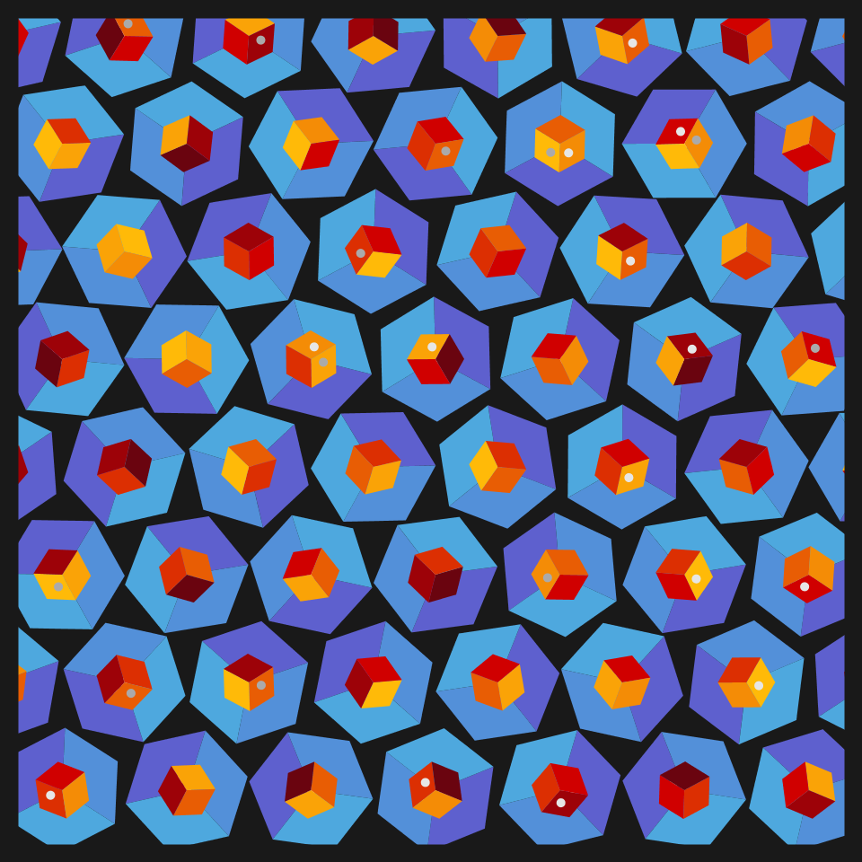
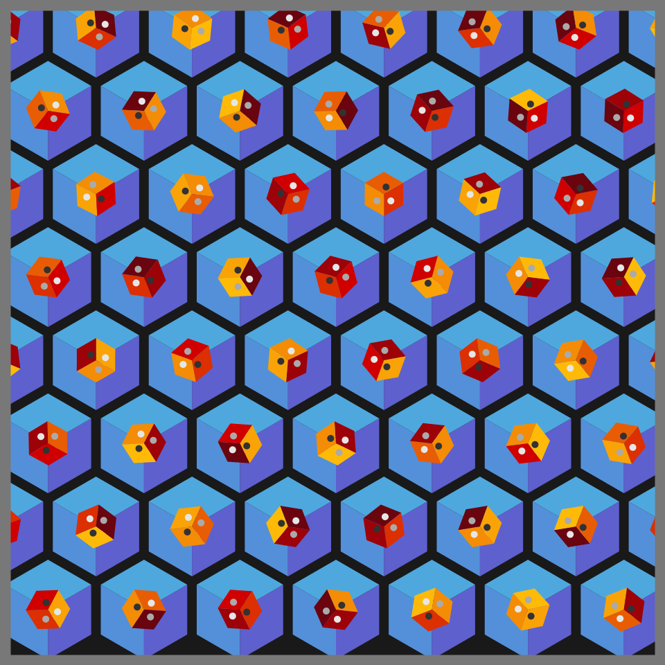
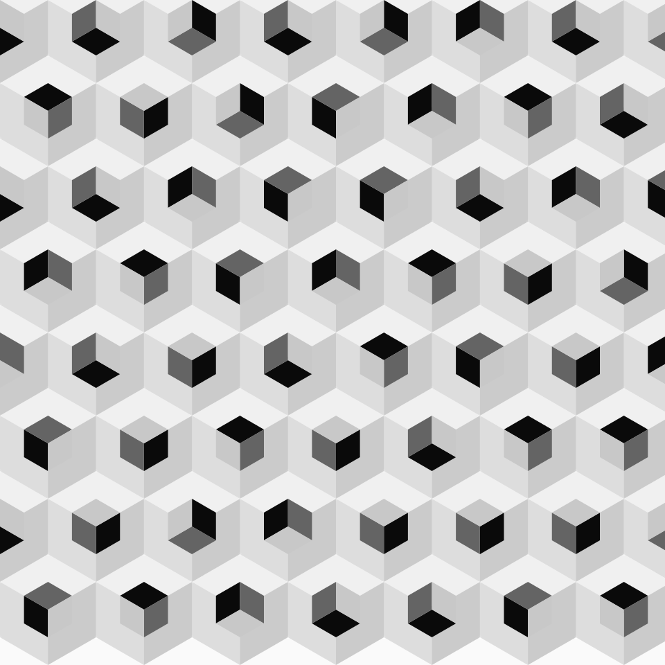
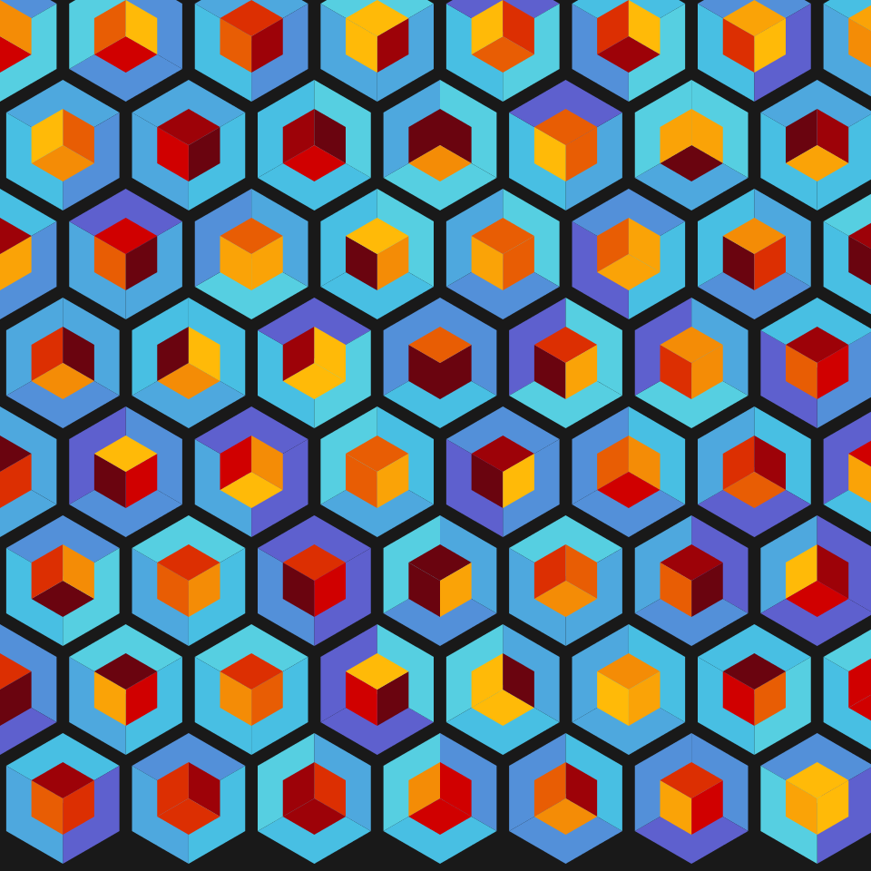

# Jan 25 Prompt: Make a grid of permutations of something.

  

## Description

Start with an isometric grid (also referred to as triangular or a Hexagonal grid). Hexagons are placed on the centers,
but instead of one, place 2 hexagons in each center point. For variation, I rotate each one. Also, the color scheme of the smaller hexagon is chosen randomly from a different (red-orange-brown) palette.

- The Code can be [found here](.)

Link to all of my [Genuary2021 Creations](https://ram-n.github.io/Genuary_2021/).
  

## Code and Common Modules
Run `permutations.py` to recreate these images. Please run this from _inside_ the Processing IDE, since it uses Processing.

For most of these, I am using the `Processing` Framework. Since I mostly code in Python, I use [the Python extension of Processing](https://py.processing.org/reference/), which is not as popular as its Java version. Also, I sometimes create small resuable code segments which I use in multiple projects. I'm sharing all my genart code, in case others find it useful.

Ram

  

Link to all of my [Genuary2021 Creations](https://ram-n.github.io/Genuary_2021/).

  
