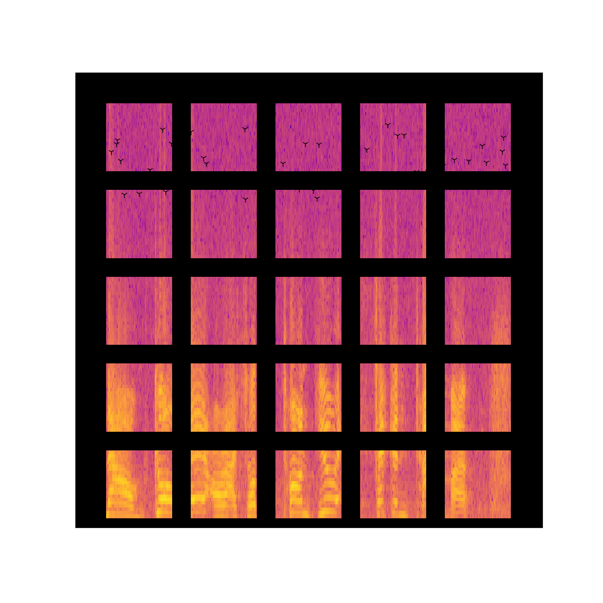
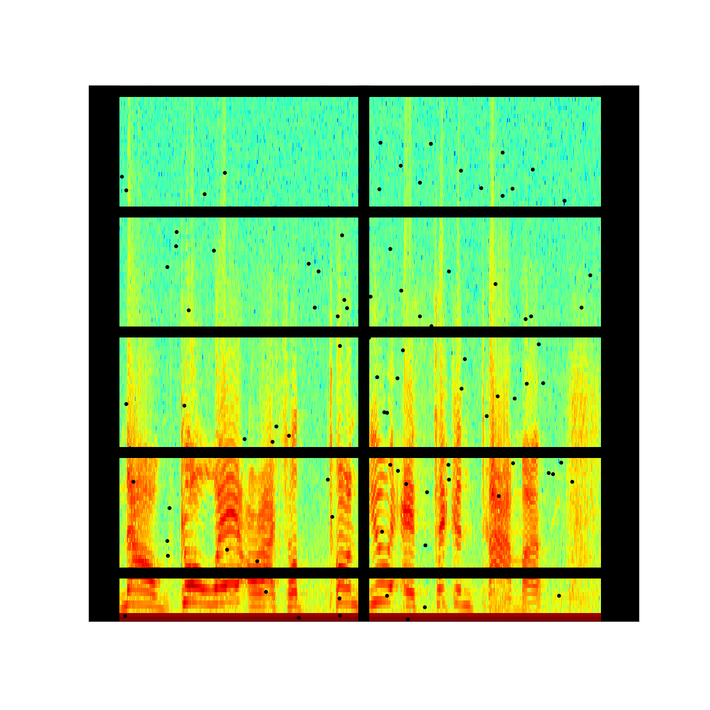
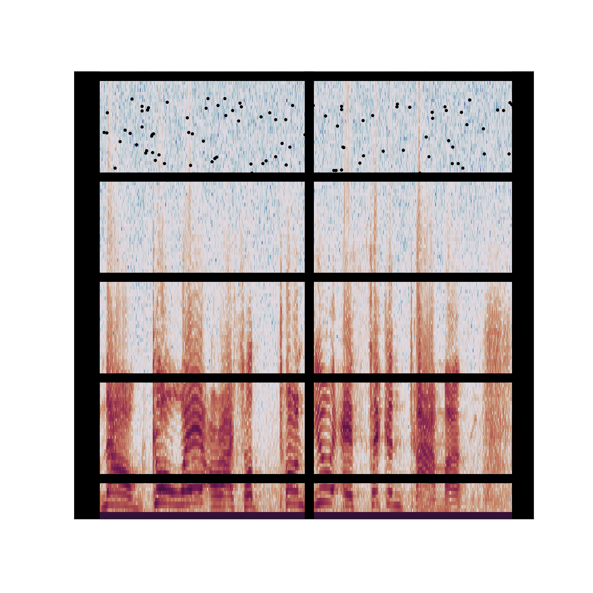

# Jan 28 Prompt: Use Sound

  

## Description

- The Code can be [found here](.)

Link to all of my [Genuary2021 Creations](https://ram-n.github.io/Genuary_2021/).

  

## Code and Common Modules
Run this Jupyter Notebook `23.0_Example_Distance_Based_Monochrome.ipynb`.
Find the [full repo](https://github.com/Ram-N/hexagons) the *.py files are needed for the Notebook to run.

For most of these, I am using the `Processing` Framework. Since I mostly code in Python, I use [the Python extension of Processing](https://py.processing.org/reference/), which is not as popular as its Java version. Also, I sometimes create small resuable code segments which I use in multiple projects. I'm sharing all my genart code, in case others find it useful.

Ram

  

Link to all of my [Genuary2021 Creations](https://ram-n.github.io/Genuary_2021/).

