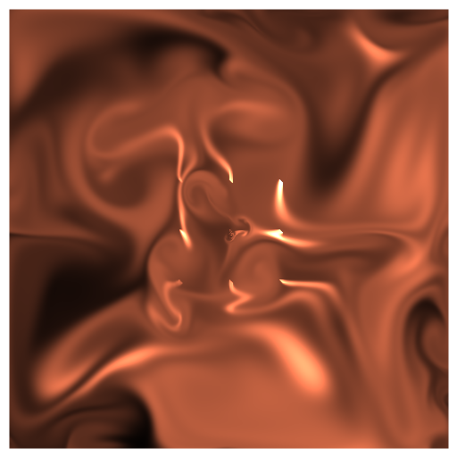
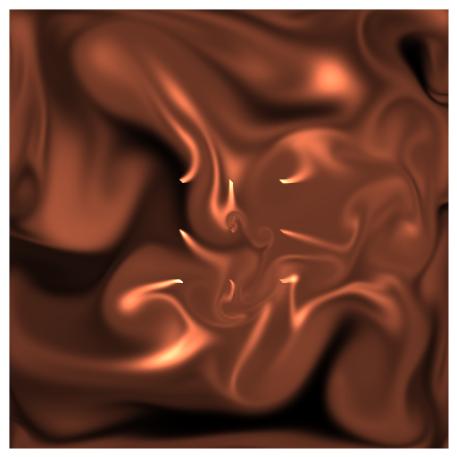
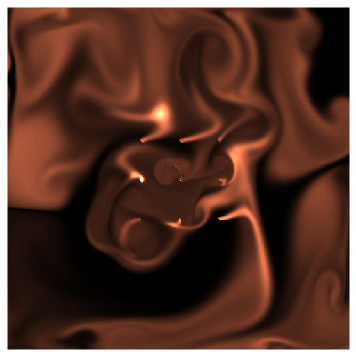

# Jan 30 Prompt: Replicate a Natural concept

  

## Description

Basic fluid simulation, with multiple points of dye-introduction. The code is mostly borrowed, and I played around with colors and points of fluid introductions to understand how things work. 

- The Code can be [found here](.)

Link to all of my [Genuary2021 Creations](https://ram-n.github.io/Genuary_2021/).

  

## Technical

- To get the effect I wanted, I had to introduce a grid of 9 points (3x3) around the center for 'dye-introduction.'
- Color was difficult to achieve, and it took a lot of trial and error. See some of the other attempts in the images directory.

## Code and Common Modules
Go to the `Fluid_Simulation` directory, and run `Fluid_Simulate.pde` to recreate these images. Please run this from _inside_ the Processing IDE, since it uses Processing.

For most of these, I am using the `Processing` Framework. Since I mostly code in Python, I use [the Python extension of Processing](https://py.processing.org/reference/), which is not as popular as its Java version. Also, I sometimes create small resuable code segments which I use in multiple projects. I'm sharing all my genart code, in case others find it useful.

Ram

  

Link to all of my [Genuary2021 Creations](https://ram-n.github.io/Genuary_2021/).

