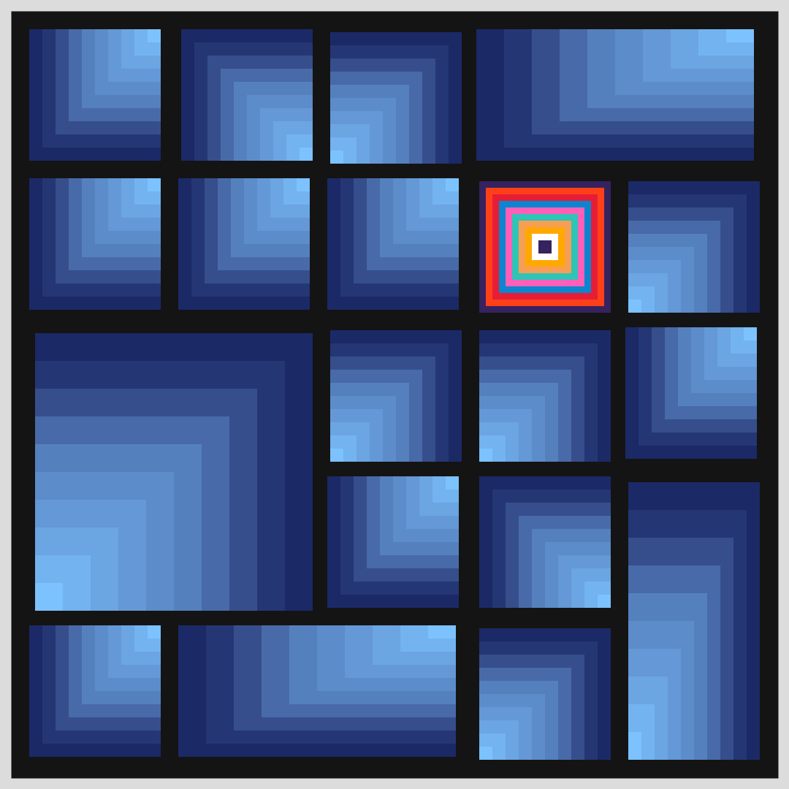

# Jan 31 Prompt: Brian Eno's Oblique Strategies Cards

  

## Description
Chose "Repetition is a form of change." In a 5x5 grid, a series of L-shapes are nested and repeated. Theie color sequence repeated as well. For variation, some squares cell are combined to form a 2x2, 1x2 and 2x1 sets, with rotation added.

- The Code can be [found here](.)

Link to all of my [Genuary2021 Creations](https://ram-n.github.io/Genuary_2021/).

  

## Cards that I considered

- Repetition is a form of change
- Define an area as `safe' and use it as an anchor

Others I considered:
- Ghost echoes
- Remove specifics and convert to ambiguities
- Cluster analysis

  

## Code and Common Modules
Run `oblique.py` to recreate these images. Please run this from _inside_ the Processing IDE, since it uses Processing.
It also uses a common file called `shapes_library.py` which you must import from the `common` directory.

For most of these, I am using the `Processing` Framework. Since I mostly code in Python, I use [the Python extension of Processing](https://py.processing.org/reference/), which is not as popular as its Java version. Also, I sometimes create small resuable code segments which I use in multiple projects. I'm sharing all my genart code, in case others find it useful.

Ram

  

Link to all of my [Genuary2021 Creations](https://ram-n.github.io/Genuary_2021/).

