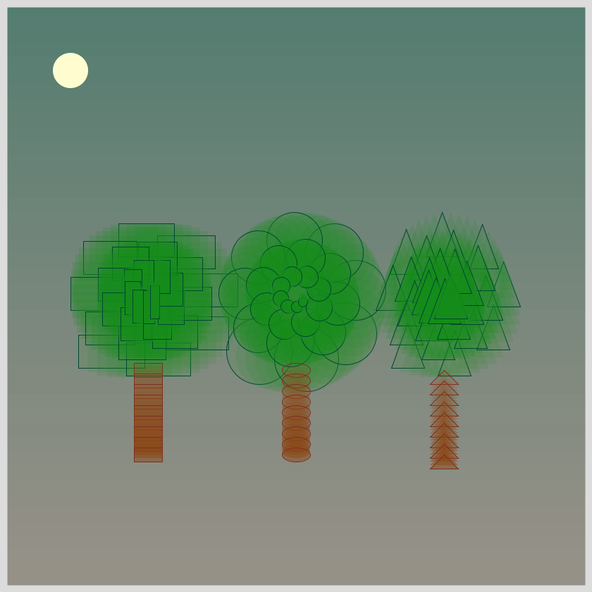
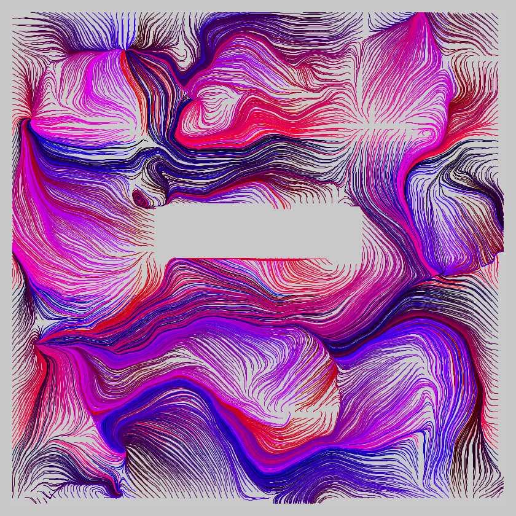
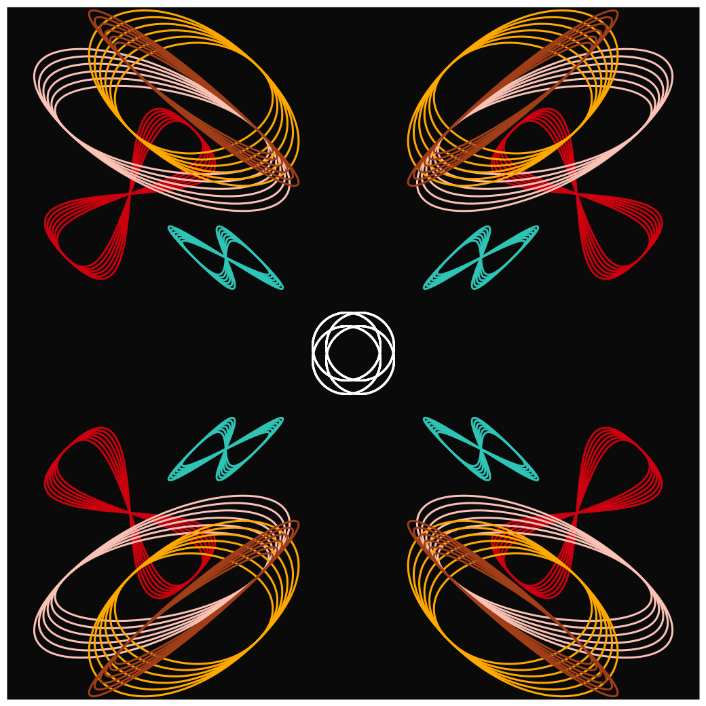
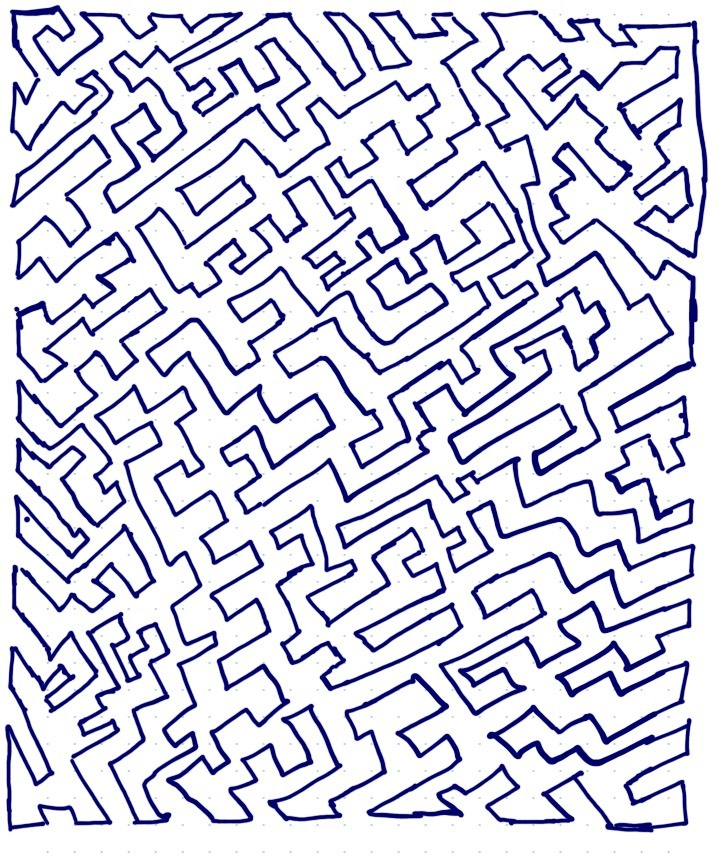
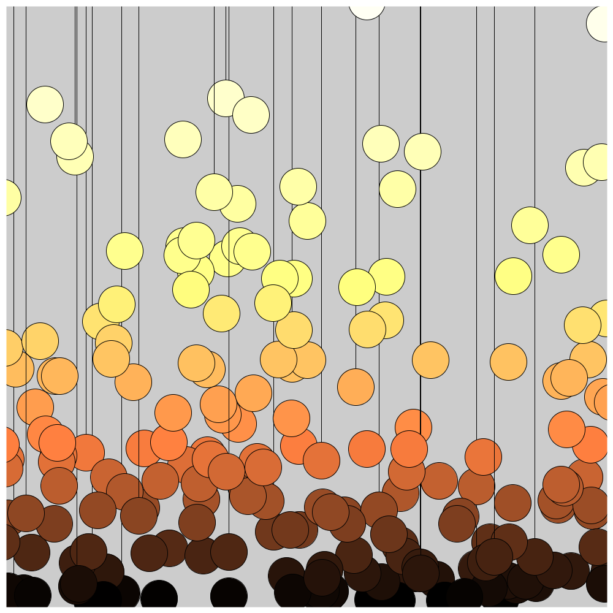
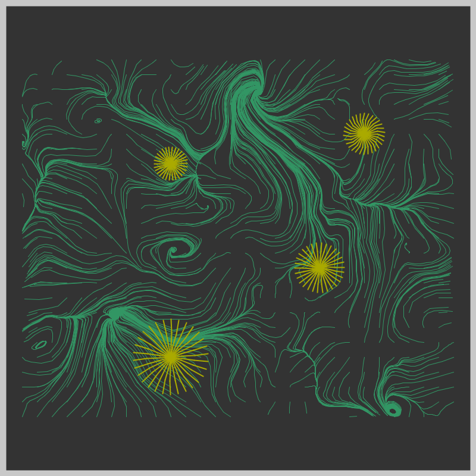
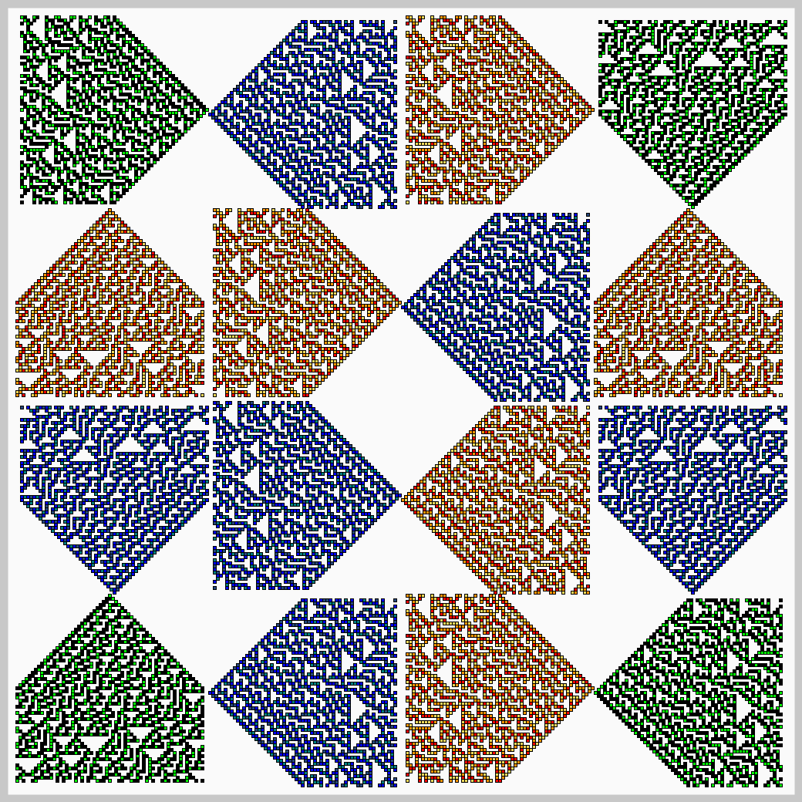
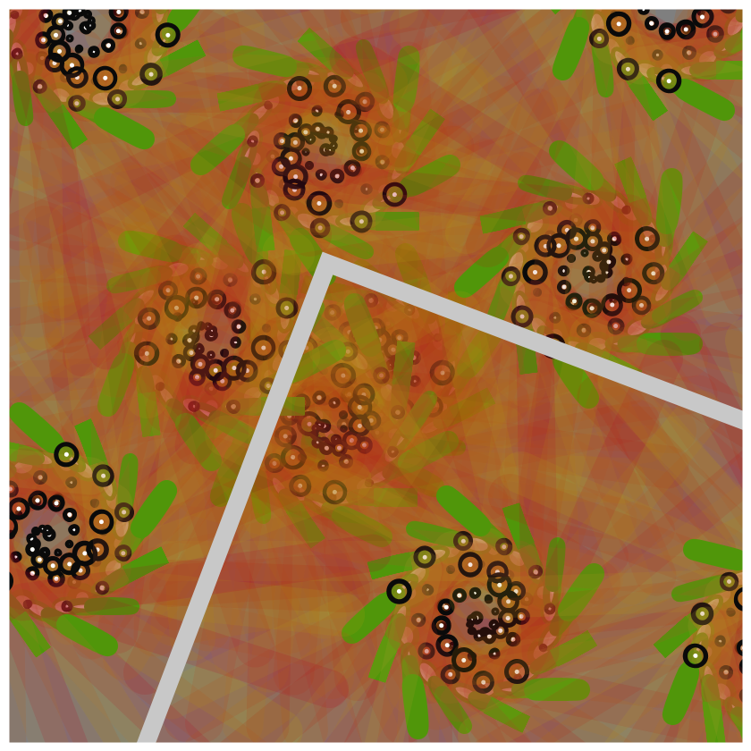

# Genuary_2021
Generative Art that is based on daily prompts for the month of January 2021

- Easier to read Description and Documentation at Github Pages that accompanies this repo.

For details, please read: https://genuary2021.github.io/

## Prompts

A group of generative artists have collaborated and created a "prompt" for each day.
Click for the prompts for each day. [Here](https://genuary2021.github.io/prompts) are the actual prompts, but you’re only supposed to do them on that particular day.

## Jan 11: Non-computer Autonomous Process [Code](Jan11_Other_Autonomous)
  

## Jan 10: Tree [Code](Jan10_Tree)
  

## Jan 09: Interference Patterns [Code](Jan09_Interference_Patterns)
  

## Jan 08 Curve Only [Code](Jan08_Curve_Only)
  

## Jan 07 Generate Rules - Hand Drawn [Code](Jan07_Rules_and_Hand-drawn)
  

## Jan 06 Triangle Subdivision [Code](Jan06_Triangle_Subdivision)
  

## Jan 05 Code Golf [Code](Jan05_Code_Golf)
  

## Jan 04 Small Areas of Symmetry [Code](Jan04_Symmetry)
  

## Jan 03 Something Human [Code](Jan03_Something_Human)

## Jan 02 Rule 30 [Code](Jan02_Rule30)

## Jan 01 Triple Nested Loops [Code](Jan01_Triple_Nested_Loops)

## Project Structure

For each day that I attempt to create something, I hope to follow this structure
- Art artifact (jpeg, png or gif)
- A brief description of the end product, and possibly the thinking behind it
- Some technical notes and challenges
- Code
- References, if any

## Code and Common Modules

For most of these, I am using the `Processing` Framework. Since I mostly code in Python, I use [the Python extension of Processing](https://py.processing.org/reference/), which is not as popular as its Java version. Also, I sometimes create small resuable code segments
which I use in multiple projects. I'm sharing all my genart code, in case it is useful to others.

Ram 