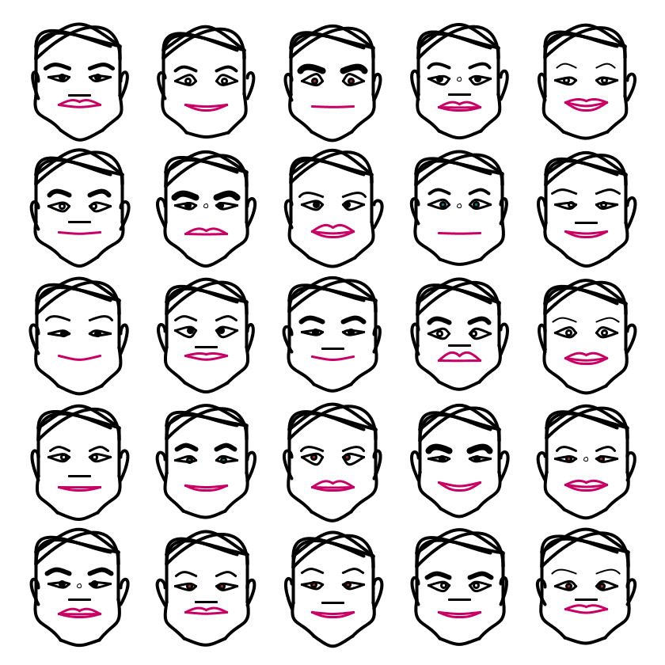

# Genuary_2021
Generative Art that is based on daily prompts for the month of January 2021

- Easier to read Description and Documentation at [Github Pages](https://ram-n.github.io/Genuary_2021/) that accompanies this repo.

For details, please read: https://genuary2021.github.io/

## Prompts

A group of generative artists have collaborated and created a "prompt" for each day.
Click for the prompts for each day. [Here](https://genuary2021.github.io/prompts) are the actual prompts, but you’re only supposed to do them on that particular day.

## Jan 26 Prompt: 2D Perspective. [Code](Jan26_2D_Perspective/)

## Jan 25 Prompt: Make a grid of permutations of something. [Code](Jan25_Grid_Permutations/)

## Jan 24 Prompt: 500 Lines [Code](Jan24_500_Lines/)

## Jan 23 Prompt: #264653 #2a9d8f #e9c46a #f4a261 #e76f51, no gradients. [Code](Jan23_Palette_No_Gradients/)

## Jan 22 Prompt: Draw a Line. Wrong Answers only. [Code](Jan22_Draw_A_Line/)

## Jan 21 Prompt: Recursion f(x) {Draw(x) and call f(x/2)}  [Code](Jan21_Recursion/)

## Jan 20 Prompt: No Loops [Code](Jan20_No_Loops/)

## Jan 19 Prompt: Increase the randomness along the Y-axis. [Code](Jan19_Yaxis_Randomness/)

## Jan 18 -Prompt: Prompt: One process grows, another process prunes. [Code](Jan18_Process_Growth_Pruning/)

## Jan 17 -Prompt: Draw a line, pick a new color, move a bit. [Code](Jan17_Line_Color_Move/)

## Jan 16: Circles Only [Code](Jan16_Circles_Only)
  

## Jan 15: Rules by Someone Else [Code](Jan15_Rules_By_Someone_Else)
  

## Jan 14: Subdivision [Code](Jan14_Subdivision)
  

## Jan 13: Do Not Repeat [Code](Jan13_Do_Not_Repeat)
  

## Jan 12: Public API to create Art [Code](Jan12_Use_API)
  

## Jan 11: Non-computer Autonomous Process [Code](Jan11_Other_Autonomous)
  

## Jan 10: Tree [Code](Jan10_Tree)
  

## Jan 09: Interference Patterns [Code](Jan09_Interference_Patterns)
  

## Jan 08 Curve Only [Code](Jan08_Curve_Only)
  

## Jan 07 Generate Rules - Hand Drawn [Code](Jan07_Rules_and_Hand-drawn)
  

## Jan 06 Triangle Subdivision [Code](Jan06_Triangle_Subdivision)
  

## Jan 05 Code Golf [Code](Jan05_Code_Golf)
  

## Jan 04 Small Areas of Symmetry [Code](Jan04_Symmetry)
  

## Jan 03 Something Human [Code](Jan03_Something_Human)

## Jan 02 Rule 30 [Code](Jan02_Rule30)

## Jan 01 Triple Nested Loops [Code](Jan01_Triple_Nested_Loops)

## Project Structure

In each day's directory, you should find the following.
- Art artifact (jpeg, png or gif) files under the images/ directory
- A brief description of the end product, and possibly the thinking behind it, where appropriate
- Some technical notes and challenges
- References, if any
- Code (the *.py that you can run under Processing)

## Code and Common Modules

For most of these, I am using the `Processing` Framework. Since I mostly code in Python, I use [the Python extension of Processing](https://py.processing.org/reference/), which is not as popular as its Java version. Also, I sometimes create small resuable code segments
which I use in multiple projects. I'm sharing all my genart code, in case it is useful to others.

Ram 